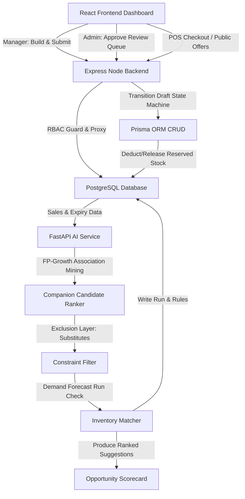
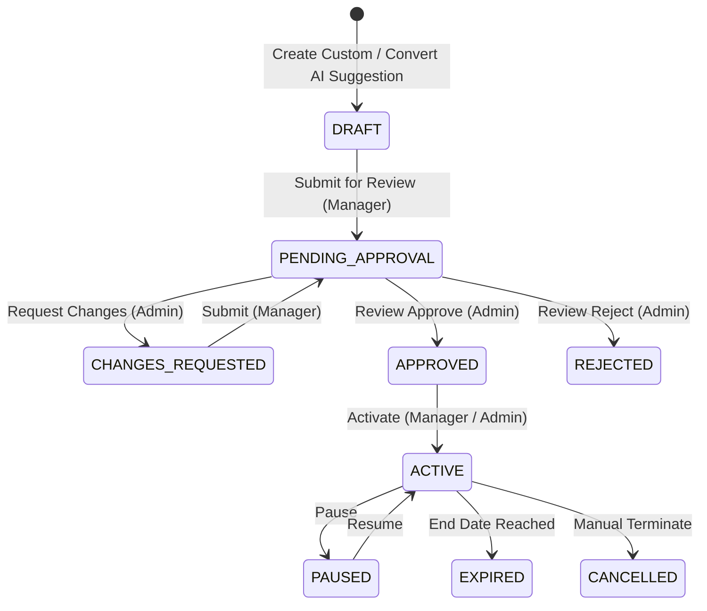

# 🤖 AI Combo & Discount Suggester — Developer & Manager Guide

> A comprehensive, end-to-end documentation of the StockSense AI-Assisted, Inventory-Aware, and Profit-Safe Combo and Discount Suggestion module. This document covers the database schema, data mining pipeline (FP-Growth), substitute product exclusions, financial safeguards, state transitions, and UI controls.

---

## 🧩 Architectural Overview

The AI Combo Suggester identifies overstocked, slow-moving, or near-expiry items ("Target Products") and recommends optimal companion products ("Anchor Products") to bundle into discount promotions. The suggestions are derived from consumer transaction histories and safety constraints.

---

## 🗄️ Database Design (The 19 Core Models)

The module introduces 19 new tables to handle settings, pipeline runs, mined relationships, suggestions, operational combo configurations, and checkout telemetry:

### ⚙️ 1. Configurations & Settings
*   **`ComboBusinessSetting`**: Stores global parameters for margin safety, discount caps, and limits:
    *   `DEFAULT_MINIMUM_MARGIN_PERCENT` (Default: 20%) — Prevents profit-negative campaigns.
    *   `GLOBAL_MAX_DISCOUNT_PERCENT` (Default: 25%) — Prevents excessive discounts.

### 📊 2. Association Runs & Rules
*   **`ProductAssociationRun`**: Header log for association rule generation runs (stores status, parameters, runtime metrics).
*   **`ProductAssociationRule`**: Mined market basket rules between SKU pairs (antecedent and consequent) using FP-Growth metrics (`support`, `confidence`, `lift`).
*   **`CategoryAssociation`**: Aggregated affinity rules at the product category level (e.g., Snacks pairing with Beverages).

### 🚫 3. Exclusions & Product Relations
*   **`ProductSubstituteRelation`**: Flags SKUs that are substitute alternatives (e.g., Coke vs. Pepsi). Helps prevent bundling items that cannibalize each other's sales.
*   **`SeasonalProductAnalysis`**: Compiles product lifts during seasonal events (e.g., holidays, festivals).
*   **`SeasonalAssociationRule`**: Rules matching seasonal affinity between items.

### 🔎 4. Opportunity Tracking
*   **`ComboOpportunity`**: Active alerts for overstocked, slow-moving, or near-expiry SKUs that need promotion. Includes priority scores based on shelf capacity and coverage days.
*   **`ComboAnchorCandidate`**: Companion anchors ranked for an opportunity, compiled from association rules, sales velocities, and category affinities.

### 💡 5. AI Suggestions & Items
*   **`ComboSuggestion`**: Draft promo suggestions generated by the AI model. Includes proposed bundle prices and margin percentages.
*   **`ComboSuggestionItem`**: Mapped SKUs in the proposed combo, detailing quantities, regular prices, and cost margins.
*   **`ComboSuggestionEvidence`**: Trace logs detailing the rules, expiries, or overstock conditions that justify the suggestion.

### 🔄 6. Operational Promoted Combos & Logs
*   **`Combo`**: Operational combo draft or active promotional campaigns.
*   **`ComboItem`**: Products included in the operational combo, with batch allocations and reserved stocks.
*   **`ComboApprovalHistory`**: Audit trail of transitions (Created, Submitted, Approved, Rejected, Changes Requested).
*   **`ComboNotification`**: Target notifications alerting managers of critical overstocks.
*   **`ComboSale`**: Checkout telemetry tracking sales of combos at POS.
*   **`ComboPerformance`**: Compiled analytics (units sold, total revenue, profit generated, and forecast coverage).

---

## ⚙️ The Suggestion & Mining Pipeline

The suggesting engine uses a multi-layered filtering process to generate profit-safe and inventory-aware offers:

### 1. Chronological Ingestion & Context
The pipeline ingests transactions preceding the `cutoffDate` (defaulting to current date). It automatically retrieves the **most recent completed DemandForecastRun** for the target month to reuse predicted demand, overstock velocity classifications, and stock coverage calculations instead of recalculating future demand.

### 2. FP-Growth Association Rules Mining
The AI scans POS Sales Bills to construct item baskets and mining rules:
*   **Support**: How frequently the pair occurs together in overall bills:
    $$\text{Support}(A \rightarrow B) = \frac{\text{Transactions containing } A \text{ and } B}{\text{Total Transactions}}$$
*   **Confidence**: Likelihood that buying antecedent A leads to buying consequent B:
    $$\text{Confidence}(A \rightarrow B) = \frac{\text{Transactions containing } A \text{ and } B}{\text{Transactions containing } A}$$
*   **Lift**: Strength of the pairing rule compared to random chance:
    $$\text{Lift}(A \rightarrow B) = \frac{\text{Support}(A \rightarrow B)}{\text{Support}(A) \times \text{Support}(B)}$$
    *   *Rules with Lift > 1.0 indicate strong positive affinity.*

### 3. Exclusions & Substitutes Layer
If the companion candidate is marked as a substitute relation (`ProductSubstituteRelation` status `CONFIRMED`) for the target SKU, it is filtered out of suggestions. This prevents creating bundles containing two equivalent products (which would lead to zero basket growth and margin dilution). This check can only be bypassed by an explicit `adminOverride` flag.

### 4. Financial Safeguard Verification
Before rendering any suggest draft, the system verifies that the proposal adheres to the safety settings configured in `ComboBusinessSetting`:
$$\text{Expected Margin \%} = \frac{\text{Combo Price} - \text{Total Cost of Items}}{\text{Combo Price}} \times 100\%$$
*   **Margin Lock**: If $\text{Expected Margin \%} < 20\%$, a warning is shown. If the profit margin is negative, a critical error prevents saving or submitting.
*   **Discount Cap**: Individual item discount allocation is validated against the maximum threshold (default: 25%) to prevent margin degradation.

### 5. Expiry Check
For near-expiry campaigns, the combo's `endDate` must be strictly prior to the expiry dates of all included product batches. This ensures that expired inventory is cleared *before* its shelf-life ends and never sold past its safe usage limits.

---

## 🔄 Operational Transition Workflow (State Machine)

Combos follow a strict, audited lifecycle with Role-Based Access Control (RBAC) validations:

### 🔒 Role Constraints (RBAC)
*   **Inventory Manager**:
    *   Can run rule mining, convert AI suggestions, create custom drafts, and submit them for approval.
    *   Cannot approve, reject, or request changes on combos.
*   **Administrator**:
    *   Can approve, reject, or request changes on pending combos.
    *   Writes comments and audits the baseline margins against the proposed discount margins.

### 📦 Stock Reservation & Deallocation
*   **Activation (`ACTIVE`)**: Iterates through combo items and locks quantities by setting the `stockReserved` field. This prevents other managers from over-promising available stock in duplicate campaigns.
*   **Pausing / Expiration (`PAUSED`, `EXPIRED`, `CANCELLED`)**: Releases `stockReserved` back into general availability.

---

## 📈 Performance Tracking Telemetry
Once active, checkout bills matching the combo code are logged in `ComboSale`. The `ComboPerformance` telemetry compiles key metrics:
1.  **Total Sales Volume**: Count of combo units scanned at POS.
2.  **Revenue Generated**: Sum of actual sales value.
3.  **Profit Contribution**: Actual margin captured during the promotion.
4.  **Excess Recovery Ratio**: Percentage of target overstock successfully cleared.
