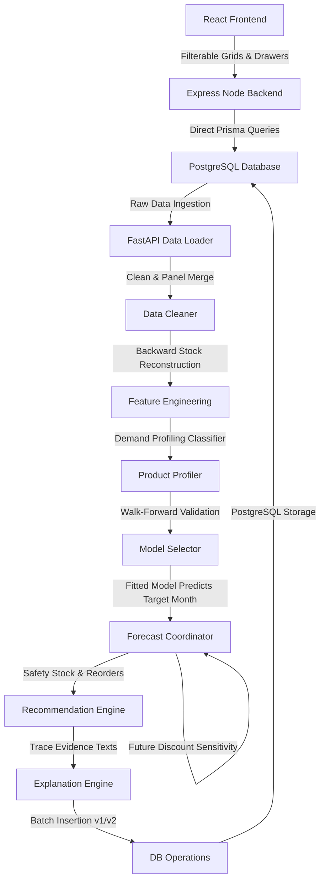

# 🤖 AI Demand Forecasting — Developer & Manager Guide

> A comprehensive, end-to-end documentation of the StockSense AI Demand Forecasting engine. This document covers data ingestion, feature engineering, demand profiling, validation backtesting, machine learning models, stock recommendations, and backend query routing.

---

## 🧩 Architectural Overview

The AI Demand Forecasting module is designed to predict product-level sales demand for the upcoming calendar month using historical transaction data (up to 3 years). It helps retail managers optimize inventory levels, maintain safety buffers, and prevent stock-outs.

---

## 📅 Chronological Timeline Setup

The forecasting engine runs monthly or on-demand:
1. **Target Month**: The calendar month being forecasted (e.g., January 2026).
2. **Data Cutoff Date**: The last day of the month preceding the target month (e.g., December 31, 2025). 
3. **History Range**: Begins on `2023-01-01` and runs until the cutoff date.
4. **Data Leakage Safeguard**: No data from the target month is accessed during feature generation, model training, or backtesting validation.

---

## 🗄️ Database Ingestion

The FastAPI loader queries PostgreSQL for five types of transaction logs up to the cutoff date:

1. **🛒 Sales Data**: Returns daily gross quantity sold, discounted quantity sold, average unit price, and sales revenue per SKU.
2. **🔄 Refund Data**: Returns daily returned quantities per SKU.
3. **📦 Goods Received Notes (GRN)**: Returns daily supplier restock quantities.
4. **📋 Stock Adjustments**: Returns daily manual stock corrections. These are loaded separately as positive adjustments (manual additions) and negative adjustments (reductions, damage, expiry).
5. **🏷️ Discounts**: Active and approved discount campaigns (approval status `APPROVED`) matching the products and dates.

---

## ⚙️ The Data Cleansing & Reconstruction Pipeline

### 1. Panel Generation
To avoid gaps in historical records, the system constructs a continuous daily panel for each active product:
- The timeline starts on the product's `launch_date` and ends on the `cutoff_date`.
- **Discontinued Handling**: If a product's status is `DISCONTINUED` or `INACTIVE`, the timeline is capped at the product's last recorded transaction date in the sales or adjustment tables to prevent empty panel calculations.
- Missing days are filled with zeros for quantities and default prices.
- **Net Sold Quantity** is calculated as:
  $$\text{Net Sales}[t] = \max(0, \text{Gross Quantity Sold}[t] - \text{Refunded Quantity}[t])$$

### 2. Historical Stock Reconstruction
Since the database only stores the current stock snapshot, the AI reconstructs past stock levels by iterating backward from the current stock level on the cutoff date:
$$\text{Opening Stock}[t] = \text{Closing Stock}[t] - \text{GRN}[t] - \text{Positive Adjustments}[t] + \text{Net Sales}[t] + \text{Negative Adjustments}[t]$$
$$\text{Closing Stock}[t-1] = \text{Opening Stock}[t]$$

- **Zero-Capping**: Reconstructed opening stock is capped at `0` to prevent negative stock values.
- **Stock-Out Flags**: If a day's opening or closing stock is reconstructed as `0`, a `stockOutFlag` is set to `True` for that day, indicating a day of suppressed sales.

### 3. Feature Engineering
The AI extracts a range of statistical and trend indicators for each product:
- `usableHistoryDays`: Total history length in calendar days.
- `completeHistoryMonths`: Total complete calendar months of history.
- `recent30Sales` / `previous30Sales`: Net sales in the last 30 days and the preceding 30 days.
- `recentGrowthPercentage`: Growth/decline rate between the two 30-day windows (safely returns `None` or `0.0` if the previous period has zero sales).
- `threeMonthAverage` / `sixMonthAverage` / `twelveMonthAverage`: Rolling monthly averages.
- `sameMonthHistoricalAverage`: Average monthly sales in the target calendar month across past years (e.g., average of Jan 2023, Jan 2024, Jan 2025).
- `seasonalUpliftPercentage`: Seasonality ratio comparing the target month's historical average to the overall rolling average.
- `discountUpliftPercentage`: Historical daily sales uplift observed on discount campaign days vs non-discount days.
- `stockOutDays`: Total days where the product was out of stock.
- `coefficientOfVariation`: Standard deviation of sales divided by average sales, measuring demand volatility.
- `averageDemandInterval` (ADI): Average number of days between sales.

---

## 🏷️ Demand Behavior Classification

Products are classified into distinct demand profiles to guide model eligibility:

*   **`LIMITED_HISTORY`**: Usable history days are less than 90 days.
*   **`INTERMITTENT`**: ADI is greater than 1.3 OR zero sales ratio is greater than 60%. (Typical for slow-moving items).
*   **`SEASONAL`**: Seasonal uplift percentage for the target month is $\ge 15\%$.
*   **`TRENDING_UP`**: Trend slope is $> 0.05$ and trend direction is UP.
*   **`TRENDING_DOWN`**: Trend slope is $< -0.05$ and trend direction is DOWN.
*   **`HIGH_VARIABILITY`**: Coefficient of variation is greater than 1.0. (High volatility, hard to predict).
*   **`DISCOUNT_SENSITIVE`**: Historical discount uplift percentage is $\ge 15\%$.
*   **`STABLE`**: Low volatility, consistent sales patterns.

---

## 🧠 Model Validation & Selection

### 1. Walk-Forward Validation Backtesting
Instead of random splitting, which breaks time-series dependencies, models are evaluated using a **Walk-Forward Validation** pipeline:
- It uses the final three complete months of history as validation windows.
- For each window, the models are trained on all history preceding that window and evaluated against actual sales during that window.
- The validation error metrics computed are:
  - **Mean Absolute Error (MAE)**:
    $$MAE = \frac{1}{N} \sum_{t=1}^{N} |y_t - \hat{y}_t|$$
  - **Root Mean Squared Error (RMSE)**:
    $$RMSE = \sqrt{\frac{1}{N} \sum_{t=1}^{N} (y_t - \hat{y}_t)^2}$$
  - **Weighted Absolute Percentage Error (WAPE)**:
    $$WAPE = \frac{\sum |y_t - \hat{y}_t|}{\sum y_t}$$

### 2. Candidate Model Selection
Candidate models are filtered based on the product's demand profile:
- **`STABLE`**: Moving Average, Linear Regression, Random Forest.
- **`SEASONAL`**: Seasonal Naive, Moving Average, Random Forest, Gradient Boosting.
- **`TRENDING`**: Linear Regression, Moving Average, Random Forest, Gradient Boosting.
- **`INTERMITTENT`**: Croston Method, Moving Average.
- **`LIMITED_HISTORY`**: Moving Average (30-day window).
- **`HIGH_VARIABILITY`**: Random Forest, Gradient Boosting, Moving Average.

**Parsimonious Complexity Rules:**
1. If data history is less than 45 days, the pipeline defaults to a simple Moving Average.
2. For longer histories, the candidate model with the lowest validation WAPE is selected.
3. **Complexity Penalty**: A complex model (Random Forest, Gradient Boosting) is only selected if it outperforms the baseline Moving Average model by at least **5% relative WAPE** ($WAPE_{complex} < WAPE_{MA} \times 0.95$).
4. The winning model is fitted on the entire historical dataset to generate target month predictions.

---

## 📈 Prediction & Restock Recommendations

### 1. Daily Prediction and Discount Uplift
The winning model predicts daily demand for each day in the target month.
- **Future Discount Adjustments**: If an approved discount campaign is running for the product during the target month, and the selected model is a baseline model (Moving Average, Seasonal Naive, Croston), the predicted demand is adjusted by multiplying it by the historical `discountUpliftPercentage` (uplift capped at **50%** to prevent demand inflation).

### 2. Purchase Order Recommendations
- **Safety Stock**:
  $$\text{Safety Stock} = \lceil \text{Predicted Demand} \times 15\% \rceil$$
- **Required Stock**:
  $$\text{Required Stock} = \text{Predicted Demand} + \text{Safety Stock}$$
- **Recommended Purchase Order Quantity**:
  $$\text{Recommended Quantity} = \max(0, \text{Required Stock} - \text{Current Stock} - \text{Confirmed Incoming Stock})$$

### 3. Inventory Health Status
- 🔴 **`CRITICAL_ACTION`**: Current stock is below predicted demand or required stock, recommended order is $> 0$, and stock coverage is less than 12 days (or stock is completely depleted).
- 🟡 **`OVERSTOCK_RISK`**: Current stock is greater than required stock by more than 150%, and stock coverage is greater than 45 days.
- 🟢 **`SUFFICIENT`**: Current stock safely covers next month's demand and safety buffer.

---

## ✍️ Natural Language Explanation Generation
The explanation engine compiles a detailed paragraph linking the forecast to calculated features:
- *"Sales increased by 11.2% during the most recent 30-day period compared to the previous 30 days."*
- *"Historically, January demand is seasonal, averaging 20.0% higher in January."*
- *"The selected Random Forest model achieved a validation WAPE of 12.5%."*
- *"An estimated 45 units should be reordered, including a 15% safety stock allowance (8 units)."*

---

## 🗄️ Database & Controller Architecture

### 1. Versioning & Duplicate Prevention
- **Versioning**: Subsequent runs for the same target month increment the `version` counter (`v1 -> v2`) rather than deleting previous run records.
- **Scheduled Runs**: The Node scheduler checks for runs on the 1st day of each month. If a completed run already exists for the month, the scheduler skips triggering a new run to prevent duplicate runs.

### 2. Direct-Query Architecture
To ensure the system remains responsive even if the Python AI service is offline, all read paths query PostgreSQL directly via Prisma client:
- **`aiDemandController.ts`**: Queries tables (`DemandForecastRun`, `DemandAnalysis`, `DemandForecast`) directly, joining with `Product` and `Category` tables.
- **`forecastScheduler.ts`**: Toggles background runs.
