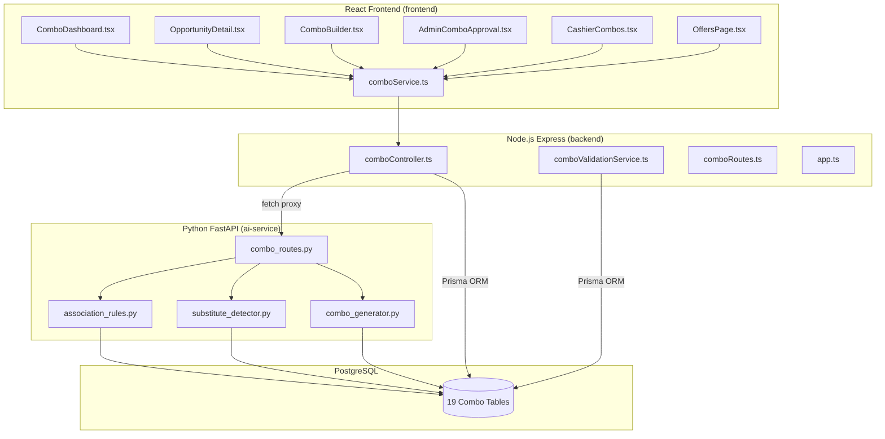
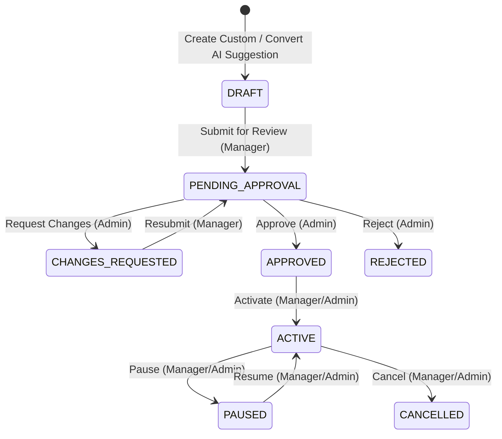
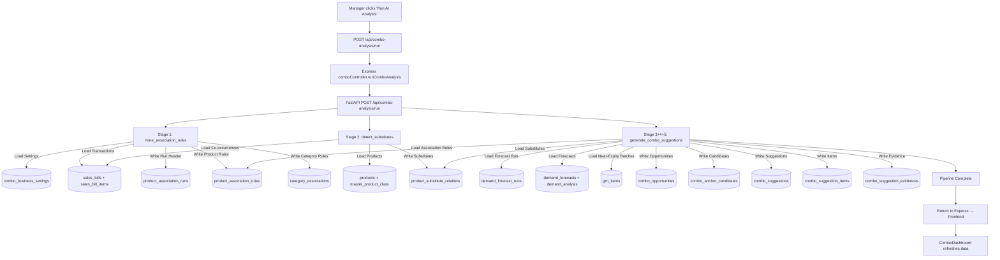
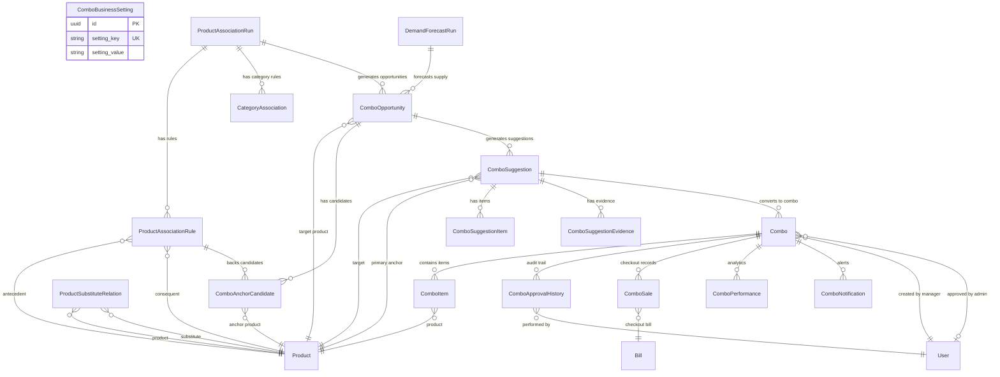

# AI-Assisted, Inventory-Aware, and Profit-Safe Combo & Discount Suggestion Module

## Complete Technical Documentation

> **Project:** StockSense  
> **Module Scope:** AI Combo & Discount Suggester  
> **Documentation Based On:** Actual codebase implementation analysis  
> **Architectural Layers:** Python FastAPI AI Service · Node.js/Express Backend · React Frontend  

---

## Table of Contents

1. [Module Purpose and Executive Summary](#1-module-purpose-and-executive-summary)
2. [System Architecture Overview](#2-system-architecture-overview)
3. [Technology Stack](#3-technology-stack)
4. [Database Schema — All Combo-Related Tables](#4-database-schema--all-combo-related-tables)
5. [ComboBusinessSetting — Configuration Table](#5-combobusinesssetting--configuration-table)
6. [ProductAssociationRun — Mining Run Header](#6-productassociationrun--mining-run-header)
7. [ProductAssociationRule — Mined Rules](#7-productassociationrule--mined-rules)
8. [CategoryAssociation — Category-Level Rules](#8-categoryassociation--category-level-rules)
9. [ProductSubstituteRelation — Substitute Exclusion Registry](#9-productsubstituterelation--substitute-exclusion-registry)
10. [SeasonalEvent, SeasonalProductAnalysis, SeasonalAssociationRule](#10-seasonalevent-seasonalproductanalysis-seasonalassociationrule)
11. [ComboOpportunity — Inventory Alert Classification](#11-comboopportunity--inventory-alert-classification)
12. [ComboAnchorCandidate — Ranked Companion Products](#12-comboanchorcandidate--ranked-companion-products)
13. [ComboSuggestion — AI-Generated Promo Proposal](#13-combosuggestion--ai-generated-promo-proposal)
14. [ComboSuggestionItem — Suggestion Line Items](#14-combosuggestionitem--suggestion-line-items)
15. [ComboSuggestionEvidence — Justification Trace](#15-combosuggestionevidence--justification-trace)
16. [Combo — Operational Promotional Campaign](#16-combo--operational-promotional-campaign)
17. [ComboItem — Campaign Line Items](#17-comboitem--campaign-line-items)
18. [ComboApprovalHistory — Audit Trail](#18-comboapprovalhistory--audit-trail)
19. [ComboSale — Checkout Telemetry](#19-combosale--checkout-telemetry)
20. [ComboPerformance — Performance Analytics](#20-comboperformance--performance-analytics)
21. [ComboNotification — In-App Alerts](#21-combonotification--in-app-alerts)
22. [Seeded Business Settings — Default Configuration Values](#22-seeded-business-settings--default-configuration-values)
23. [AI Pipeline — Stage 1: Association Rule Mining](#23-ai-pipeline--stage-1-association-rule-mining)
24. [AI Pipeline — Stage 2: Substitute Product Detection](#24-ai-pipeline--stage-2-substitute-product-detection)
25. [AI Pipeline — Stage 3: Opportunity Detection](#25-ai-pipeline--stage-3-opportunity-detection)
26. [AI Pipeline — Stage 4: Anchor Candidate Ranking](#26-ai-pipeline--stage-4-anchor-candidate-ranking)
27. [AI Pipeline — Stage 5: Combo Suggestion & Pricing Engine](#27-ai-pipeline--stage-5-combo-suggestion--pricing-engine)
28. [Mathematical Formulas Used](#28-mathematical-formulas-used)
29. [FastAPI Routes — AI Service Endpoints](#29-fastapi-routes--ai-service-endpoints)
30. [Backend Controller — Express Proxy & Prisma CRUD](#30-backend-controller--express-proxy--prisma-crud)
31. [Backend Routes — RESTful API Map](#31-backend-routes--restful-api-map)
32. [Backend Validation Service — Business Rule Enforcement](#32-backend-validation-service--business-rule-enforcement)
33. [State Machine — Combo Lifecycle Transitions](#33-state-machine--combo-lifecycle-transitions)
34. [RBAC — Role-Based Access Control Matrix](#34-rbac--role-based-access-control-matrix)
35. [Demand Forecast Integration](#35-demand-forecast-integration)
36. [Stock Reservation & Deallocation Logic](#36-stock-reservation--deallocation-logic)
37. [Frontend Service Layer — comboService.ts](#37-frontend-service-layer--comboservicets)
38. [Frontend — ComboDashboard Page](#38-frontend--combodashboard-page)
39. [Frontend — OpportunityDetail Page](#39-frontend--opportunitydetail-page)
40. [Frontend — ComboBuilder Page](#40-frontend--combobuilder-page)
41. [Frontend — AdminComboApproval Page](#41-frontend--admincomboappproval-page)
42. [Frontend — CashierCombos Page (POS)](#42-frontend--cashiercombos-page-pos)
43. [Frontend — Public OffersPage Integration](#43-frontend--public-offerspage-integration)
44. [Frontend Route Configuration](#44-frontend-route-configuration)
45. [Data Flow — End-to-End Pipeline Diagram](#45-data-flow--end-to-end-pipeline-diagram)
46. [Discount Allocation Strategy (60/40 Split)](#46-discount-allocation-strategy-6040-split)
47. [Large Basket Filtering Logic](#47-large-basket-filtering-logic)
48. [Scheduled Jobs & Automation](#48-scheduled-jobs--automation)
49. [Performance Tracking & Post-Campaign Analytics](#49-performance-tracking--post-campaign-analytics)
50. [Risks, Gaps, and Incomplete Implementations](#50-risks-gaps-and-incomplete-implementations)
51. [Appendix A: Full File Inventory](#51-appendix-a-full-file-inventory)
52. [Appendix B: Entity-Relationship Summary](#52-appendix-b-entity-relationship-summary)

---

## 1. Module Purpose and Executive Summary

The AI Combo & Discount Suggestion Module is a multi-layered system that:

1. **Identifies problematic inventory** — products classified as slow-moving, dead stock, overstocked, or near-expiry.
2. **Mines consumer transaction history** — discovers statistically significant product pair associations using co-occurrence counting (labelled `FP_GROWTH_OR_COOCCURRENCE`).
3. **Detects substitute products** — prevents bundling items that cannibalize each other's demand.
4. **Generates profit-safe combo suggestions** — proposes bundle pricing constrained by configurable margin floors and discount caps.
5. **Provides a manager/admin approval workflow** — enforces RBAC-protected state transitions before combos become active at POS.
6. **Exposes active combos to cashiers and the public** — displays approved promotions at checkout and on the public website.

**Implementation Evidence:**
- `ai-service/app/services/association_rules.py` → `mine_association_rules()`
- `ai-service/app/services/substitute_detector.py` → `detect_substitutes()`
- `ai-service/app/services/combo_generator.py` → `generate_combo_suggestions()`
- `backend/src/controllers/comboController.ts` → All CRUD & proxy functions
- `backend/src/services/comboValidationService.ts` → `ComboValidationService`

---

## 2. System Architecture Overview



**Communication Pattern:**
- The React frontend communicates exclusively with the Express backend via `comboService.ts` → Axios HTTP calls.
- The Express backend proxies AI-intensive operations to the FastAPI service via `fetch()` calls to `AI_SERVICE_URL` (default: `http://127.0.0.1:8000/api/combo-analysis`).
- The FastAPI service communicates directly with PostgreSQL via SQLAlchemy raw SQL queries.
- The Express backend communicates with PostgreSQL via Prisma ORM for CRUD operations.

**Implementation Evidence:**
- `backend/src/app.ts:21` → `import comboRoutes from './routes/comboRoutes.js'`
- `backend/src/app.ts:70` → `app.use('/api', comboRoutes)`
- `ai-service/main.py:9` → `app.include_router(combo_router)`

---

## 3. Technology Stack

| Layer | Technology | Purpose |
|-------|-----------|---------|
| AI Service | Python 3, FastAPI, SQLAlchemy, pandas, NumPy | Rule mining, substitute detection, combo generation |
| Backend API | Node.js, Express, TypeScript, Prisma ORM | CRUD, validation, RBAC, state machine, proxy |
| Frontend | React, TypeScript, Axios, React Router | Dashboard, builder, approval queue, POS lookup |
| Database | PostgreSQL | All persistent storage (19 combo-specific tables) |
| Algorithm | Co-occurrence pair counting (2-itemsets) | Association rule mining (labelled `FP_GROWTH_OR_COOCCURRENCE`) |

---

## 4. Database Schema — All Combo-Related Tables

The module introduces **19 database tables**, defined in `backend/prisma/schema.prisma` (lines 599–1109). Below is the complete table inventory:

| # | Prisma Model | DB Table Name | Purpose |
|---|-------------|---------------|---------|
| 1 | `ComboBusinessSetting` | `combo_business_settings` | Global configuration parameters |
| 2 | `ProductAssociationRun` | `product_association_runs` | Mining run header/audit log |
| 3 | `ProductAssociationRule` | `product_association_rules` | Mined SKU-pair association rules |
| 4 | `CategoryAssociation` | `category_associations` | Category-level association rules |
| 5 | `ProductSubstituteRelation` | `product_substitute_relations` | Substitute product registry |
| 6 | `SeasonalEvent` | `seasonal_events` | Seasonal event definitions |
| 7 | `SeasonalProductAnalysis` | `seasonal_product_analyses` | Product-level seasonal demand analysis |
| 8 | `SeasonalAssociationRule` | `seasonal_association_rules` | Seasonal association rules |
| 9 | `ComboOpportunity` | `combo_opportunities` | Inventory opportunity alerts |
| 10 | `ComboAnchorCandidate` | `combo_anchor_candidates` | Ranked companion anchor products |
| 11 | `ComboSuggestion` | `combo_suggestions` | AI-generated combo proposals |
| 12 | `ComboSuggestionItem` | `combo_suggestion_items` | Suggestion line items |
| 13 | `ComboSuggestionEvidence` | `combo_suggestion_evidences` | Justification evidence records |
| 14 | `Combo` | `combos` | Operational promotional campaigns |
| 15 | `ComboItem` | `combo_items` | Campaign line items |
| 16 | `ComboApprovalHistory` | `combo_approval_histories` | Approval audit trail |
| 17 | `ComboSale` | `combo_sales` | POS checkout telemetry |
| 18 | `ComboPerformance` | `combo_performance` | Post-campaign analytics |
| 19 | `ComboNotification` | `combo_notifications` | In-app notification alerts |

**Implementation Evidence:** `backend/prisma/schema.prisma:599–1109`

---

## 5. ComboBusinessSetting — Configuration Table

**DB Table:** `combo_business_settings`  
**Prisma Model:** `ComboBusinessSetting` → `schema.prisma:599–610`

| Column | Type | Description |
|--------|------|-------------|
| `id` | UUID PK | Primary key |
| `setting_key` | String (UNIQUE) | Configuration identifier (e.g., `MIN_SUPPORT`) |
| `setting_value` | String | Value stored as string, cast at runtime |
| `data_type` | String | Type hint (`INT`, `FLOAT`) |
| `description` | String? | Human-readable explanation |
| `is_active` | Boolean | Soft toggle for settings |

**Usage Pattern:** Both the AI service (via raw SQL) and the backend validation service (via Prisma) read these settings at runtime to parameterize all thresholds.

**Implementation Evidence:**
- AI reads: `association_rules.py:19–27` → `SELECT setting_key, setting_value FROM combo_business_settings WHERE is_active = true`
- Backend reads: `comboValidationService.ts:35` → `prisma.comboBusinessSetting.findMany({ where: { isActive: true } })`

---

## 6. ProductAssociationRun — Mining Run Header

**DB Table:** `product_association_runs`  
**Prisma Model:** `ProductAssociationRun` → `schema.prisma:612–635`

| Column | Type | Description |
|--------|------|-------------|
| `id` | UUID PK | Run identifier |
| `analysis_start_date` | Date | Start of transaction analysis window |
| `analysis_end_date` | Date | End of transaction analysis window (cutoff) |
| `algorithm` | String | Always `'FP_GROWTH_OR_COOCCURRENCE'` |
| `minimum_support` | Float | Support threshold used for this run |
| `minimum_confidence` | Float | Confidence threshold used |
| `minimum_lift` | Float | Lift threshold used |
| `transaction_count` | Int | Total qualifying transactions analyzed |
| `product_count` | Int | Distinct products in the analysis set |
| `status` | String | `RUNNING` → `COMPLETED` / `FAILED` |
| `started_at` | DateTime | When the run began |
| `completed_at` | DateTime? | When the run finished |
| `error_message` | String? | Error details if `FAILED` |
| `version` | Int | Default `1` |
| `created_by` | String? | User who triggered the run |

**Relations:**
- One-to-many → `ProductAssociationRule[]`
- One-to-many → `CategoryAssociation[]`
- One-to-many → `ComboOpportunity[]`

**Implementation Evidence:** `association_rules.py:57–78` → `INSERT INTO product_association_runs (...)`

---

## 7. ProductAssociationRule — Mined Rules

**DB Table:** `product_association_rules`  
**Prisma Model:** `ProductAssociationRule` → `schema.prisma:637–677`

| Column | Type | Description |
|--------|------|-------------|
| `id` | UUID PK | Rule ID |
| `association_run_id` | FK → `ProductAssociationRun` | Parent run |
| `antecedent_product_id` | FK → `Product.sku` | "If customer buys THIS..." |
| `consequent_product_id` | FK → `Product.sku` | "...they also buy THAT" |
| `antecedent_family_id` | FK? → `MasterProductClass` | Family of antecedent |
| `consequent_family_id` | FK? → `MasterProductClass` | Family of consequent |
| `pair_purchase_count` | Int | Absolute count of co-purchases |
| `antecedent_purchase_count` | Int | Total transactions containing antecedent |
| `consequent_purchase_count` | Int | Total transactions containing consequent |
| `support` | Float | Support metric |
| `confidence` | Float | Confidence metric (directional: A→B) |
| `reverse_confidence` | Float | Reverse confidence (B→A) |
| `lift` | Float | Lift metric |
| `weighted_support` | Float | `support × lift` |
| `stability_month_count` | Int | Months the pair has been observed |
| `stability_year_count` | Int | Years the pair has been observed |
| `large_basket_ratio` | Float | Always `0.0` (placeholder) |
| `category_compatibility_score` | Float | Always `1.0` (placeholder) |
| `family_compatibility_score` | Float | Always `1.0` (placeholder) |
| `substitute_risk_score` | Float | Always `0.0` (placeholder) |
| `relationship_score` | Float | `confidence × lift × 10.0` |
| `relationship_status` | String | `STRONG` (≥15) / `MODERATE` (≥5) / `WEAK` |
| `first_observed_date` | Date? | Earliest transaction date for this pair |
| `last_observed_date` | Date? | Latest transaction date for this pair |

**Unique Constraint:** `@@unique([associationRunId, antecedentProductId, consequentProductId])`

**Key Detail:** Rules are stored **bidirectionally** — for every qualifying pair (A, B), both (A→B) and (B→A) are inserted if each direction's confidence exceeds `MIN_CONFIDENCE`.

**Implementation Evidence:** `association_rules.py:196–262`

---

## 8. CategoryAssociation — Category-Level Rules

**DB Table:** `category_associations`  
**Prisma Model:** `CategoryAssociation` → `schema.prisma:679–699`

| Column | Type | Description |
|--------|------|-------------|
| `id` | UUID PK | Rule ID |
| `source_category_id` | FK → `Category` | Source category |
| `target_category_id` | FK → `Category` | Target category |
| `pair_count` | Int | Co-occurrence count |
| `support` | Float | Category-level support |
| `confidence` | Float | Category-level confidence |
| `lift` | Float | Category-level lift |
| `relationship_score` | Float | `confidence × lift × 10.0` |
| `relationship_status` | String | `STRONG` (≥12) / `MODERATE` (≥4) / `WEAK` |
| `analysis_run_id` | FK → `ProductAssociationRun` | Parent run |

**Unique Constraint:** `@@unique([analysisRunId, sourceCategoryId, targetCategoryId])`

**Upsert Pattern:** Uses `ON CONFLICT DO UPDATE` for idempotent writes.

**Implementation Evidence:** `association_rules.py:267–331`

> ⚠️ **Observation:** Category associations are mined and persisted but are **not consumed** by any downstream process (the combo generator does not query `category_associations`). They exist in the database but serve no functional role in suggestion generation.

---

## 9. ProductSubstituteRelation — Substitute Exclusion Registry

**DB Table:** `product_substitute_relations`  
**Prisma Model:** `ProductSubstituteRelation` → `schema.prisma:701–717`

| Column | Type | Description |
|--------|------|-------------|
| `id` | UUID PK | Relation ID |
| `product_id` | FK → `Product.sku` | Source product |
| `substitute_product_id` | FK → `Product.sku` | Substitute product |
| `detection_source` | String | `PRODUCT_FAMILY` / `CATEGORY_SIMILARITY` / `TRANSACTION_PATTERN` |
| `substitute_score` | Float | Confidence of substitutability (0–1) |
| `status` | String | `CONFIRMED` / `POSSIBLE` |

**Unique Constraint:** `@@unique([productId, substituteProductId])`

**Storage Pattern:** Substitutes are stored **bidirectionally** — for every pair (A, B), both (A→B) and (B→A) are inserted.

**Three Detection Methods:**

| Method | Source | Score | Status | Criteria |
|--------|--------|-------|--------|----------|
| `PRODUCT_FAMILY` | Same `MasterProductClass` (same family, different variants) | `1.0` | `CONFIRMED` | Two products share the same `master_id` |
| `CATEGORY_SIMILARITY` | Same subcategory + same brand + price within 20% | `0.8` | `POSSIBLE` | Different `master_id` but matching subcategory, brand, and price band |
| `TRANSACTION_PATTERN` | Same subcategory, ≥30 individual sales each, co-occurrence overlap ratio < 2% | `0.75` | `POSSIBLE` | Mutual exclusivity in transaction baskets |

**Implementation Evidence:** `substitute_detector.py:7–179`

---

## 10. SeasonalEvent, SeasonalProductAnalysis, SeasonalAssociationRule

**DB Tables:** `seasonal_events`, `seasonal_product_analyses`, `seasonal_association_rules`  
**Prisma Models:** `schema.prisma:719–785`

### SeasonalEvent
| Column | Type | Description |
|--------|------|-------------|
| `id` | UUID PK | Event ID |
| `name` | String | Event name (e.g., "Avurudu Season") |
| `event_type` | String | Event classification |
| `analysis_start_month/day` | Int | Window start |
| `analysis_end_month/day` | Int | Window end |
| `target_year` | Int? | Optional year scope |
| `status` | String | Event status |

### SeasonalProductAnalysis
Tracks seasonal demand uplift per product (fields: `seasonal_sales`, `normal_period_sales`, `seasonal_uplift_percentage`, `seasonal_demand_score`, `is_seasonal`).

### SeasonalAssociationRule
Seasonal-specific association rules between product pairs.

> ⚠️ **Not Implemented:** While the database schema is fully defined and the `ComboOpportunity` model includes a `seasonal_event_id` FK, the AI service `combo_routes.py:58–68` contains only a **stub** `/seasonal` endpoint that prints a log and returns success without performing any actual analysis. No seasonal opportunity detection is implemented in `combo_generator.py`. The seasonal tables exist but are **never populated by the AI pipeline**.

**Implementation Evidence:**
- Schema exists: `schema.prisma:719–785`
- Stub endpoint: `combo_routes.py:58–68` → `return {"success": True, "message": "Seasonal analysis completed."}`

---

## 11. ComboOpportunity — Inventory Alert Classification

**DB Table:** `combo_opportunities`  
**Prisma Model:** `ComboOpportunity` → `schema.prisma:787–828`

| Column | Type | Description |
|--------|------|-------------|
| `id` | UUID PK | Opportunity ID |
| `forecast_run_id` | FK → `DemandForecastRun` | Source forecast run |
| `association_run_id` | FK → `ProductAssociationRun` | Source association run |
| `seasonal_event_id` | FK? → `SeasonalEvent` | Always `NULL` in current implementation |
| `target_product_id` | FK → `Product.sku` | Target SKU requiring stock clearance |
| `target_batch_id` | FK? → `GrnItem` | Specific batch (for `NEAR_EXPIRY`) |
| `opportunity_type` | String | `NEAR_EXPIRY` / `DEAD_STOCK` / `OVERSTOCK` / `SLOW_MOVING` |
| `velocity_class` | String | `NEAR_EXPIRY` / `DEAD` / `MEDIUM` / `SLOW` |
| `current_stock` | Int | Physical stock on hand |
| `available_stock` | Int | Stock available for promotion |
| `predicted_demand` | Int | From demand forecast |
| `safety_stock` | Int | From demand forecast |
| `required_stock` | Int | From demand forecast |
| `stock_coverage_days` | Float | From demand forecast |
| `excess_stock` | Int | Stock exceeding forecast requirements |
| `days_since_last_sale` | Int | Staleness indicator |
| `expiry_date` | Date? | Batch expiry (for `NEAR_EXPIRY`) |
| `days_to_expiry` | Int? | Days until batch expires |
| `priority_score` | Float | Urgency rank (0–100) |
| `opportunity_status` | String | `NEW` / `CONVERTED` / `IGNORED` / `EXPIRED` |

**Unique Constraint:** `@@unique([forecastRunId, associationRunId, targetProductId, targetBatchId, opportunityType])`

**Upsert Pattern:** Uses `ON CONFLICT DO UPDATE` for idempotent updates on re-runs.

**Implementation Evidence:** `combo_generator.py:214–262`

### Opportunity Type Detection Logic

| Type | Detection Criteria | Priority Score Formula | Source |
|------|-------------------|----------------------|--------|
| `NEAR_EXPIRY` | Batch `epd` between today and `today + NEAR_EXPIRY_DAYS`, `final_quantity > 0` | `100 - (daysToExpiry / NEAR_EXPIRY_DAYS × 50)` | `combo_generator.py:64–116` |
| `DEAD_STOCK` | Product with `recent_30_sales == 0` and `current_stock > 0` | Fixed `85.0` | `combo_generator.py:148–167` |
| `OVERSTOCK` | `current_stock > required_stock` AND `coverage > OVERSTOCK_COVERAGE_DAYS` | `min(90.0, 40.0 + (coverage / 90 × 10))` | `combo_generator.py:170–190` |
| `SLOW_MOVING` | `coverage > SLOW_MOVING_COVERAGE_DAYS` AND (`behavior == 'INTERMITTENT'` OR `predicted_demand < current_stock / 2`) | `min(75.0, 30.0 + (coverage / 60 × 12))` | `combo_generator.py:193–212` |

---

## 12. ComboAnchorCandidate — Ranked Companion Products

**DB Table:** `combo_anchor_candidates`  
**Prisma Model:** `ComboAnchorCandidate` → `schema.prisma:830–866`

| Column | Type | Description |
|--------|------|-------------|
| `id` | UUID PK | Candidate ID |
| `opportunity_id` | FK → `ComboOpportunity` | Parent opportunity |
| `anchor_product_id` | FK → `Product.sku` | Proposed companion product |
| `association_rule_id` | FK → `ProductAssociationRule` | Supporting association rule |
| `pair_purchase_count` | Int | Historical co-purchase count |
| `support` | Float | Rule support |
| `confidence` | Float | Rule confidence |
| `lift` | Float | Rule lift |
| `relationship_score` | Float | From association rule |
| `anchor_velocity_class` | String | Anchor's demand behavior |
| `anchor_current_stock` | Int | Anchor's on-hand quantity |
| `anchor_predicted_demand` | Int | Anchor's forecasted demand |
| `anchor_safety_stock` | Int | `demand × 0.15` |
| `anchor_promotional_stock` | Int | `stock × (1 - PROMO_BUFFER_PCT)` |
| `anchor_stock_coverage_days` | Float | Anchor's stock coverage |
| `anchor_stock_out_risk` | Float | Always `0.0` |
| `normal_profit_contribution` | Float | `(price - cost) / max(1, price)` |
| `compatibility_score` | Float | `confidence × 100` |
| `stock_safety_score` | Float | `min(1, coverage / 100) × 100` |
| `profitability_score` | Float | `profitability × 100` |
| `final_candidate_score` | Float | Weighted composite score |
| `candidate_rank` | Int | Position after sorting |
| `status` | String | `ELIGIBLE` (rank ≤ 3) / `NOT_SELECTED` |

**Unique Constraint:** `@@unique([opportunityId, anchorProductId])`

### Candidate Scoring Formula

```
finalCandidateScore = (compatibilityScore × 0.50) + (profitabilityScore × 0.25) + (stockSafetyScore × 0.25)

Where:
  compatibilityScore = confidence × 100
  profitabilityScore = ((sellingPrice - costPrice) / max(1, sellingPrice)) × 100
  stockSafetyScore   = min(1, stockCoverageDays / 100) × 100
```

**Weight Distribution:** 50% association affinity, 25% profitability, 25% stock safety.

**Selection Rule:** Only the top 3 candidates per opportunity receive `ELIGIBLE` status; the rest are marked `NOT_SELECTED`.

**Implementation Evidence:** `combo_generator.py:334–416`

---

## 13. ComboSuggestion — AI-Generated Promo Proposal

**DB Table:** `combo_suggestions`  
**Prisma Model:** `ComboSuggestion` → `schema.prisma:868–910`

| Column | Type | Description |
|--------|------|-------------|
| `id` | UUID PK | Suggestion ID |
| `opportunity_id` | FK → `ComboOpportunity` | Source opportunity |
| `suggestion_version` | Int | Default `1` |
| `target_product_id` | FK → `Product.sku` | Target product |
| `primary_anchor_product_id` | FK → `Product.sku` | Primary anchor (rank #1 candidate) |
| `combo_size` | Int | Always `2` (target + anchor) |
| `suggestion_type` | String | Same as `opportunityType` |
| `normal_total_price` | Float | Sum of individual selling prices |
| `total_cost` | Float | Sum of individual cost prices |
| `minimum_safe_price` | Float | Floor price for margin safety |
| `recommended_price` | Float | AI-suggested combo price |
| `maximum_safe_discount` | Float | `normalTotal - minimumSafePrice` |
| `recommended_discount_amount` | Float | `normalTotal - recommendedPrice` |
| `recommended_discount_percentage` | Float | Discount as a percentage |
| `expected_profit` | Float | `recommendedPrice - totalCost` |
| `expected_margin_percentage` | Float | `(profit / price) × 100` |
| `customer_saving` | Float | Same as `discountAmount` |
| `maximum_combo_quantity` | Int | Limited by minimum available promotional stock |
| `recommendation_score` | Float | Same as `finalCandidateScore` |
| `confidence_level` | String | `HIGH` (conf ≥ 50%) / `MEDIUM` |
| `risk_level` | String | `LOW` (margin ≥ minMargin+5%) / `MEDIUM` |
| `explanation` | String | Natural language AI explanation |
| `evidence_summary` | String | Compact metric summary |
| `suggestion_status` | String | `GENERATED` / `CONVERTED_TO_DRAFT` |
| `expires_at` | DateTime? | `today + SUGGESTION_EXPIRY_DAYS` |

**Implementation Evidence:** `combo_generator.py:474–516`

---

## 14. ComboSuggestionItem — Suggestion Line Items

**DB Table:** `combo_suggestion_items`  
**Prisma Model:** `ComboSuggestionItem` → `schema.prisma:912–933`

| Column | Type | Description |
|--------|------|-------------|
| `id` | UUID PK | Item ID |
| `combo_suggestion_id` | FK → `ComboSuggestion` | Parent suggestion |
| `product_id` | FK → `Product.sku` | Product SKU |
| `batch_id` | FK? → `GrnItem` | Specific batch (for `NEAR_EXPIRY` targets) |
| `role` | String | `TARGET` or `ANCHOR` |
| `quantity` | Int | Always `1` |
| `normal_unit_price` | Float | Selling price of the individual item |
| `cost_price` | Float | Cost price of the individual item |
| `allocated_discount` | Float | Portion of discount allocated to this item |
| `effective_selling_price` | Float | `normalUnitPrice - allocatedDiscount` |
| `available_promotional_stock` | Int | Stock available for this promotion |
| `relationship_score` | Float | `0.0` for target, rule score for anchor |

**Discount Allocation (60/40 Split):**
- **Target item** receives 60% of the total discount amount
- **Anchor item** receives 40% of the total discount amount

**Implementation Evidence:** `combo_generator.py:518–561`

---

## 15. ComboSuggestionEvidence — Justification Trace

**DB Table:** `combo_suggestion_evidences`  
**Prisma Model:** `ComboSuggestionEvidence` → `schema.prisma:935–951`

| Column | Type | Description |
|--------|------|-------------|
| `id` | UUID PK | Evidence ID |
| `combo_suggestion_id` | FK → `ComboSuggestion` | Parent suggestion |
| `evidence_type` | String | `PURCHASE_RELATIONSHIP` / `NEAR_EXPIRY` / `OVERSTOCK` / etc. |
| `evidence_key` | String | Metric identifier (e.g., `association_lift`, `stock_coverage_days`) |
| `evidence_value` | String | Metric value as string |
| `unit` | String? | Unit of measure (`LIFT`, `DAYS`) |
| `description` | String | Human-readable description |
| `source_table` | String? | Origin table (`product_association_rules`) |
| `source_record_id` | String? | FK to original record |

**Two evidence records per suggestion:**
1. **PURCHASE_RELATIONSHIP** — Association rule lift and confidence
2. **Opportunity-specific** — Stock coverage days or days to expiry depending on `opportunityType`

**Implementation Evidence:** `combo_generator.py:563–599`

---

## 16. Combo — Operational Promotional Campaign

**DB Table:** `combos`  
**Prisma Model:** `Combo` → `schema.prisma:953–995`

| Column | Type | Description |
|--------|------|-------------|
| `id` | UUID PK | Combo ID |
| `source_suggestion_id` | FK? → `ComboSuggestion` | NULL if manually created |
| `combo_code` | String (UNIQUE) | Human-readable identifier |
| `name` | String | Campaign display name |
| `description` | String? | Campaign description / AI explanation |
| `combo_type` | String | `SLOW_MOVING` / `DEAD_STOCK` / `NEAR_EXPIRY` / `OVERSTOCK` / `SEASONAL` / `REGULAR_COMPLEMENTARY` |
| `normal_total_price` | Float | Sum of individual prices |
| `combo_price` | Float | Promotional bundle price |
| `discount_amount` | Float | Total discount |
| `discount_percentage` | Float | Discount as percentage |
| `total_cost` | Float | Sum of cost prices |
| `expected_profit` | Float | `comboPrice - totalCost` |
| `expected_margin_percentage` | Float | `(profit / price) × 100` |
| `maximum_quantity` | Int | Max promotional packs |
| `sold_quantity` | Int | Default `0` |
| `start_date` | Date | Campaign start |
| `end_date` | Date | Campaign end |
| `status` | String | Lifecycle state (see §33) |
| `created_by_inventory_manager_id` | FK → `User` | Creator |
| `submitted_at` | DateTime? | When submitted for review |
| `approved_by_admin_id` | FK? → `User` | Approving admin |
| `approved_at` | DateTime? | When approved |
| `rejection_reason` | String? | Admin rejection comment |
| `request_change_message` | String? | Admin revision feedback |

**Implementation Evidence:**
- AI-to-draft conversion: `comboController.ts:209–307` → `convertToDraft()`
- Manual creation: `comboController.ts:311–416` → `createComboDraft()`

---

## 17. ComboItem — Campaign Line Items

**DB Table:** `combo_items`  
**Prisma Model:** `ComboItem` → `schema.prisma:997–1019`

| Column | Type | Description |
|--------|------|-------------|
| `id` | UUID PK | Item ID |
| `combo_id` | FK → `Combo` | Parent combo |
| `product_id` | FK → `Product.sku` | Product |
| `batch_id` | FK? → `GrnItem` | Specific batch |
| `role` | String | `TARGET` / `ANCHOR` / `SUPPORTING` |
| `quantity` | Int | Items per combo pack |
| `normal_unit_price` | Float | Regular price |
| `cost_price` | Float | Cost price |
| `allocated_discount` | Float | Discount portion |
| `effective_price` | Float | `normalUnitPrice - allocatedDiscount` |
| `stock_reserved` | Int | Default `0`, set on activation |

**Unique Constraint:** `@@unique([comboId, productId])`

---

## 18. ComboApprovalHistory — Audit Trail

**DB Table:** `combo_approval_histories`  
**Prisma Model:** `ComboApprovalHistory` → `schema.prisma:1021–1037`

| Column | Type | Description |
|--------|------|-------------|
| `id` | UUID PK | Entry ID |
| `combo_id` | FK → `Combo` | Related combo |
| `action` | String | `CREATED` / `UPDATED` / `PENDING_APPROVAL` / `APPROVED` / `REJECTED` / `CHANGES_REQUESTED` / `ACTIVE` / `PAUSED` / `CANCELLED` |
| `previous_status` | String | State before transition |
| `new_status` | String | State after transition |
| `performed_by` | FK → `User` | Actor user ID |
| `performed_by_role` | String | Actor's role |
| `comment` | String? | Optional notes |
| `performed_at` | DateTime | Timestamp |

**Implementation Evidence:** `comboValidationService.ts:239–250`

---

## 19. ComboSale — Checkout Telemetry

**DB Table:** `combo_sales`  
**Prisma Model:** `ComboSale` → `schema.prisma:1039–1058`

| Column | Type | Description |
|--------|------|-------------|
| `id` | UUID PK | Sale ID |
| `combo_id` | FK → `Combo` | Combo sold |
| `sale_id` | FK → `Bill` | Checkout bill |
| `quantity` | Int | Units sold |
| `normal_value` | Float | Value at normal prices |
| `combo_value` | Float | Value at combo price |
| `customer_saving` | Float | Savings provided |
| `total_cost` | Float | Cost of goods |
| `realized_profit` | Float | Actual profit |
| `realized_margin_percentage` | Float | Actual margin |
| `sold_at` | DateTime | Transaction timestamp |

> ⚠️ **Observation:** While the `ComboSale` table schema is defined and the `comboController.ts` includes a `getComboPerformanceSummary()` function, there is **no implemented logic** in the POS billing system (`POSPage.tsx` or backend sale processing) that **writes** records to `ComboSale` when a combo is actually sold at checkout. The table exists but is never populated by the transaction flow.

---

## 20. ComboPerformance — Performance Analytics

**DB Table:** `combo_performance`  
**Prisma Model:** `ComboPerformance` → `schema.prisma:1060–1086`

| Column | Type | Description |
|--------|------|-------------|
| `id` | UUID PK | Record ID |
| `combo_id` | FK → `Combo` | Combo evaluated |
| `evaluation_start_date` | Date | Eval window start |
| `evaluation_end_date` | Date | Eval window end |
| `impressions` | Int | View count (default 0) |
| `view_count` | Int | Default 0 |
| `purchase_count` | Int | Default 0 |
| `units_sold` | Int | Default 0 |
| `revenue_generated` | Float | Default 0 |
| `profit_generated` | Float | Default 0 |
| `customer_savings` | Float | Default 0 |
| `target_stock_cleared` | Int | Default 0 |
| `expiry_waste_avoided_quantity` | Int | Default 0 |
| `normal_target_sales_baseline` | Float | Default 0 |
| `promotional_target_sales` | Float | Default 0 |
| `sales_uplift_percentage` | Float | Default 0 |
| `anchor_normal_sales_impact` | Float | Default 0 |
| `status` | String | Evaluation status |

> ⚠️ **Not Implemented:** The `ComboPerformance` table is defined with comprehensive analytics fields, but there is **no scheduled job, trigger, or backend function** that calculates and writes performance records. The `getComboPerformanceSummary()` and `getSingleComboPerformance()` controller functions simply read from the table (which is always empty). No batch performance evaluation engine exists.

---

## 21. ComboNotification — In-App Alerts

**DB Table:** `combo_notifications`  
**Prisma Model:** `ComboNotification` → `schema.prisma:1088–1108`

| Column | Type | Description |
|--------|------|-------------|
| `id` | UUID PK | Notification ID |
| `user_id` | FK → `User` | Recipient |
| `user_role` | String | Target role |
| `combo_suggestion_id` | FK? → `ComboSuggestion` | Related suggestion |
| `combo_id` | FK? → `Combo` | Related combo |
| `notification_type` | String | Alert type |
| `title` | String | Notification title |
| `message` | String | Body text |
| `priority` | String | `HIGH` / `MEDIUM` / `LOW` |
| `is_read` | Boolean | Read status |

> ⚠️ **Not Implemented:** The `ComboNotification` table is defined in the schema but there is **no code** that writes to it. No notification creation logic exists in the combo controller, validation service, or AI pipeline. The table is structurally present but functionally unused.

---

## 22. Seeded Business Settings — Default Configuration Values

**File:** `backend/prisma/seed/seed_combo_settings.ts` → `seedComboSettings()`

The following 21 settings are seeded via Prisma upsert on database initialization:

| Setting Key | Default Value | Type | Purpose |
|-------------|--------------|------|---------|
| `ASSOCIATION_HISTORY_MONTHS` | `36` | INT | Transaction history lookback window |
| `MIN_PAIR_COUNT` | `20` | INT | Minimum absolute pair frequency threshold |
| `MIN_SUPPORT` | `0.005` | FLOAT | FP-Growth minimum support |
| `MIN_CONFIDENCE` | `0.30` | FLOAT | Minimum directional confidence |
| `MIN_LIFT` | `1.10` | FLOAT | Minimum positive affinity lift |
| `MIN_RELATIONSHIP_MONTHS` | `6` | INT | Stability validation months |
| `MIN_RELATIONSHIP_YEARS` | `2` | INT | Stability validation years |
| `LARGE_BASKET_ITEM_LIMIT` | `10` | INT | Exclude wholesale-like transactions |
| `MAX_DEFAULT_COMBO_SIZE` | `3` | INT | Default combo product count |
| `ABSOLUTE_MAX_COMBO_SIZE` | `4` | INT | Maximum combo product count |
| `MIN_CUSTOMER_SAVING_PERCENT` | `3` | FLOAT | Minimum discount incentive |
| `GLOBAL_MAX_DISCOUNT_PERCENT` | `25` | FLOAT | Maximum allowable discount |
| `DEFAULT_MINIMUM_MARGIN_PERCENT` | `20` | FLOAT | Profit margin floor |
| `NEAR_EXPIRY_DAYS` | `45` | INT | Near-expiry classification threshold |
| `DEAD_STOCK_DAYS` | `90` | INT | Dead stock classification threshold |
| `SLOW_MOVING_COVERAGE_DAYS` | `60` | INT | Slow-moving classification threshold |
| `OVERSTOCK_COVERAGE_DAYS` | `90` | INT | Overstock classification threshold |
| `MIN_ANCHOR_STOCK_COVERAGE_DAYS` | `30` | INT | Anchor eligibility minimum coverage |
| `PROMOTIONAL_STOCK_BUFFER_PERCENT` | `10` | FLOAT | Anchor stock reserve buffer |
| `SUGGESTION_EXPIRY_DAYS` | `14` | INT | AI suggestion validity window |
| `COMBO_EVALUATION_PERIOD_DAYS` | `30` | INT | Performance evaluation window |

> ⚠️ **Observation:** Settings `MIN_RELATIONSHIP_MONTHS`, `MIN_RELATIONSHIP_YEARS`, `MAX_DEFAULT_COMBO_SIZE`, `ABSOLUTE_MAX_COMBO_SIZE`, and `COMBO_EVALUATION_PERIOD_DAYS` are seeded but **never queried** by any AI or backend logic.

---

## 23. AI Pipeline — Stage 1: Association Rule Mining

**File:** `ai-service/app/services/association_rules.py` → `mine_association_rules()`

### Input Data
- Sales transactions from `sales_bills` and `sales_bill_items` within the configured history window.
- Large-basket filter: transactions with total item quantity > `LARGE_BASKET_ITEM_LIMIT` (default 10) are excluded.

### Algorithm

The algorithm uses **brute-force 2-itemset co-occurrence counting** (not the FP-Growth tree structure). Despite the database recording `algorithm = 'FP_GROWTH_OR_COOCCURRENCE'`, the actual implementation is:

```python
# For every qualifying transaction:
for bill_id, skus in transactions_dict.items():
    unique_skus = sorted(list(set(skus)))
    for i in range(n):
        for j in range(i + 1, n):
            pair_counts[(unique_skus[i], unique_skus[j])] += 1
```

**Complexity:** O(N × k²) where N = number of transactions and k = average items per transaction.

### Filtering Pipeline
1. **Absolute frequency filter:** `pair_count >= MIN_PAIR_COUNT` (default 20)
2. **Support filter:** `support >= MIN_SUPPORT` (default 0.005)
3. **Lift filter:** `lift >= MIN_LIFT` (default 1.10)
4. **Directional confidence filter:** Only store rule direction where `confidence >= MIN_CONFIDENCE` (default 0.30)

### Output
- Bidirectional rules stored in `product_association_rules` (both A→B and B→A if each direction qualifies)
- Category associations stored in `category_associations`
- Run record updated to `COMPLETED` status

### Error Handling
- On exception: run status set to `FAILED`, `error_message` truncated to 500 characters, transaction rolled back.

**Implementation Evidence:** `association_rules.py:9–360`

---

## 24. AI Pipeline — Stage 2: Substitute Product Detection

**File:** `ai-service/app/services/substitute_detector.py` → `detect_substitutes()`

### Three Detection Methods (Executed Sequentially)

#### Method 1: PRODUCT_FAMILY
```python
# Products sharing the same MasterProductClass (variants)
grouped_by_family = products_df.groupby('master_id')
for family_id, group in grouped_by_family:
    # All permutations within family → score=1.0, status=CONFIRMED
```

#### Method 2: CATEGORY_SIMILARITY
```python
# Same subcategory + same brand + price within 20%
grouped_by_subcat = products_df.groupby(['subcategory_id', 'brand_id'])
# If price_diff ≤ 20% → score=0.8, status=POSSIBLE
```

#### Method 3: TRANSACTION_PATTERN
```python
# Same subcategory, ≥30 individual sales each
# overlap_ratio = pair_count / min(count_A, count_B)
# If overlap_ratio < 2% → score=0.75, status=POSSIBLE (mutually exclusive)
```

### Storage
- All pairs written bidirectionally via `ON CONFLICT DO UPDATE` upsert pattern.

> ⚠️ **Performance Risk:** Method 3 loads ALL co-occurrences via `SELECT bi1.sku, bi2.sku, COUNT(...) FROM sales_bill_items bi1 JOIN sales_bill_items bi2 ON bi1.bill_id = bi2.bill_id` into memory. This can be extremely expensive on large databases with millions of bill items as it generates a Cartesian product.

---

## 25. AI Pipeline — Stage 3: Opportunity Detection

**File:** `ai-service/app/services/combo_generator.py` → Lines 61–262

### Near-Expiry Detection (Lines 64–116)
```sql
SELECT gi.id, gi.sku, gi.epd, gi.final_quantity, gi.unit_cost, p.selling_price
FROM grn_items gi JOIN products p ON gi.sku = p.sku
WHERE p.status = 'ACTIVE' AND gi.epd >= :today AND gi.epd <= :expiry_cutoff AND gi.final_quantity > 0
```
- Source: `GrnItem` table (batch/lot records)
- Enriched with demand forecast data if available

### Forecast-Based Detection (Lines 118–212)
```sql
SELECT df.product_id, df.current_stock, df.predicted_demand, df.safety_stock,
       df.required_stock, df.stock_coverage_days, ...
FROM demand_forecasts df
JOIN products p ON df.product_id = p.sku
JOIN demand_analysis da ON df.forecast_run_id = da.forecast_run_id AND df.product_id = da.product_id
WHERE df.forecast_run_id = :forecast_run_id AND p.status = 'ACTIVE'
```

Decision tree applied per product:
1. `recent_30_sales == 0` → **DEAD_STOCK**
2. `current_stock > required_stock AND coverage > 90` → **OVERSTOCK**
3. `coverage > 60 AND (behavior == 'INTERMITTENT' OR predicted_demand < current_stock / 2)` → **SLOW_MOVING**

---

## 26. AI Pipeline — Stage 4: Anchor Candidate Ranking

**File:** `ai-service/app/services/combo_generator.py` → Lines 278–416

### For each detected opportunity:

1. **Query association rules** where the target product is the `antecedent_product_id`
2. **Filter candidates:**
   - Exclude if anchor is a confirmed substitute of the target
   - Exclude if anchor is the same product as the target
   - Exclude if anchor product metadata is missing
   - Exclude if anchor has no forecast data
   - Exclude if anchor `stock_coverage_days < MIN_ANCHOR_STOCK_COVERAGE_DAYS` (default 30)
   - Exclude if anchor `current_stock <= 0`
3. **Score and rank** (see formula in §12)
4. **Select top 3** as `ELIGIBLE`, rest as `NOT_SELECTED`

---

## 27. AI Pipeline — Stage 5: Combo Suggestion & Pricing Engine

**File:** `ai-service/app/services/combo_generator.py` → Lines 420–605

### For each opportunity with at least one eligible candidate:

1. **Select primary candidate** (rank #1)
2. **Calculate pricing:**
   - `normalTotal = targetPrice + anchorPrice`
   - `totalCost = targetCost + anchorCost`
   - `minimumSafePrice = totalCost / (1 - DEFAULT_MINIMUM_MARGIN_PERCENT / 100)`
3. **Determine discount rate:**
   - `NEAR_EXPIRY` or `DEAD_STOCK` → 15% discount
   - `OVERSTOCK` or `SLOW_MOVING` → 8% discount
4. **Apply constraints:**
   - Clamp discount between `MIN_CUSTOMER_SAVING_PERCENT` and `GLOBAL_MAX_DISCOUNT_PERCENT`
   - If `recommendedPrice < minimumSafePrice` → clamp to `minimumSafePrice`
   - If `recommendedPrice >= normalTotal` → skip (impossible to offer any discount)
5. **Calculate max quantity:** `min(targetAvailableStock, anchorPromotionalStock)`
6. **Generate natural language explanation**
7. **Persist** `ComboSuggestion`, two `ComboSuggestionItem` records, and two `ComboSuggestionEvidence` records

---

## 28. Mathematical Formulas Used

### Association Rule Metrics

$$\text{Support}(A, B) = \frac{\text{count}(A \cap B)}{\text{Total Transactions}}$$

$$\text{Confidence}(A \rightarrow B) = \frac{\text{count}(A \cap B)}{\text{count}(A)}$$

$$\text{Lift}(A, B) = \frac{\text{Support}(A, B)}{\text{Support}(A) \times \text{Support}(B)}$$

$$\text{Weighted Support} = \text{Support} \times \text{Lift}$$

$$\text{Relationship Score} = \text{Confidence} \times \text{Lift} \times 10.0$$

### Pricing Formulas

$$\text{Minimum Safe Price} = \frac{\text{Total Cost}}{1 - \text{MIN\_MARGIN\_PCT}}$$

$$\text{Maximum Safe Discount} = \text{Normal Total} - \text{Minimum Safe Price}$$

$$\text{Expected Profit} = \text{Combo Price} - \text{Total Cost}$$

$$\text{Expected Margin \%} = \frac{\text{Expected Profit}}{\text{Combo Price}} \times 100$$

### Candidate Ranking

$$\text{Final Score} = (\text{Confidence} \times 100 \times 0.5) + (\text{Profitability} \times 100 \times 0.25) + (\text{Stock Safety} \times 100 \times 0.25)$$

### Promotional Stock

$$\text{Anchor Promotional Stock} = \text{Anchor Stock} \times (1 - \frac{\text{PROMO\_BUFFER\_PCT}}{100})$$

$$\text{Anchor Safety Stock} = \text{Anchor Demand} \times 0.15$$

---

## 29. FastAPI Routes — AI Service Endpoints

**File:** `ai-service/app/api/combo_routes.py`  
**Router Prefix:** `/api/combo-analysis`

| Method | Path | Function | Description |
|--------|------|----------|-------------|
| `POST` | `/run` | `run_association_analysis()` | Triggers full pipeline: mine rules → detect substitutes → generate suggestions |
| `POST` | `/seasonal` | `run_seasonal_analysis()` | **Stub only** — returns success without processing |
| `GET` | `/runs/{runId}` | `get_analysis_run_status()` | Check status of an association run |
| `GET` | `/opportunities` | `get_combo_opportunities()` | List opportunities with optional filters |
| `GET` | `/opportunities/{id}` | `get_combo_opportunity_details()` | Opportunity detail with anchor candidates |
| `POST` | `/suggestions/generate/{opportunityId}` | `generate_ranked_suggestions()` | Generate suggestions for specific opportunity |
| `GET` | `/suggestions/{id}/evidence` | `get_suggestion_evidence()` | Retrieve evidence for a suggestion |

**Implementation Evidence:** `combo_routes.py:1–318`

---

## 30. Backend Controller — Express Proxy & Prisma CRUD

**File:** `backend/src/controllers/comboController.ts` (760 lines)

### Proxy Functions (Forward to FastAPI)
| Function | Proxied Route | Lines |
|----------|--------------|-------|
| `runComboAnalysis()` | `POST /run` | 11–33 |
| `getComboAnalysisStatus()` | `GET /runs/:id` | 35–49 |
| `generateSuggestions()` | `POST /suggestions/generate/:id` | 185–205 |

### Prisma CRUD Functions
| Function | Operation | Lines |
|----------|-----------|-------|
| `getOpportunities()` | List opportunities (Prisma `findMany`) | 53–82 |
| `getOpportunityDetails()` | Single opportunity with candidates | 84–113 |
| `ignoreOpportunity()` | Update status → `IGNORED` | 115–127 |
| `getSuggestions()` | List suggestions | 129–153 |
| `getSuggestionDetails()` | Single suggestion with items + evidence | 155–183 |
| `convertToDraft()` | Convert AI suggestion → Combo DRAFT | 209–307 |
| `createComboDraft()` | Manual combo creation with validation | 311–416 |
| `getCombosList()` | List all combos | 418–439 |
| `getComboDetails()` | Single combo with items + approval history | 441–462 |
| `updateComboDraft()` | Edit DRAFT/CHANGES_REQUESTED combo | 464–570 |
| `submitComboForApproval()` | DRAFT → PENDING_APPROVAL | 574–583 |
| `approveCombo()` | PENDING_APPROVAL → APPROVED | 585–594 |
| `rejectCombo()` | PENDING_APPROVAL → REJECTED | 596–606 |
| `requestComboChanges()` | PENDING_APPROVAL → CHANGES_REQUESTED | 608–618 |
| `activateCombo()` | APPROVED/PAUSED → ACTIVE | 620–629 |
| `pauseCombo()` | ACTIVE → PAUSED | 631–640 |
| `cancelCombo()` | Any → CANCELLED | 642–651 |
| `getPublicActiveCombos()` | Public API (no auth) | 655–694 |
| `getPosActiveCombos()` | POS cashier lookup | 696–726 |
| `getComboPerformanceSummary()` | Performance dashboard | 730–745 |
| `getSingleComboPerformance()` | Single combo performance | 747–759 |

---

## 31. Backend Routes — RESTful API Map

**File:** `backend/src/routes/comboRoutes.ts`  
**Mount Point:** `app.use('/api', comboRoutes)` → `backend/src/app.ts:70`

### Public (No Auth)
| Method | Full Path | Handler |
|--------|----------|---------|
| `GET` | `/api/public/combos` | `getPublicActiveCombos` |

### Authenticated — Cashier/POS
| Method | Full Path | Handler | Roles |
|--------|----------|---------|-------|
| `GET` | `/api/pos/active-combos` | `getPosActiveCombos` | ADMIN, CASHIER, INVENTORY_MANAGER |

### Authenticated — Manager & Admin
| Method | Full Path | Handler | Roles |
|--------|----------|---------|-------|
| `POST` | `/api/combo-analysis/run` | `runComboAnalysis` | ADMIN, INVENTORY_MANAGER |
| `GET` | `/api/combo-analysis/runs/:id` | `getComboAnalysisStatus` | ADMIN, INVENTORY_MANAGER |
| `GET` | `/api/combo-opportunities` | `getOpportunities` | ADMIN, INVENTORY_MANAGER |
| `GET` | `/api/combo-opportunities/:id` | `getOpportunityDetails` | ADMIN, INVENTORY_MANAGER |
| `POST` | `/api/combo-opportunities/:id/ignore` | `ignoreOpportunity` | ADMIN, INVENTORY_MANAGER |
| `GET` | `/api/combo-suggestions` | `getSuggestions` | ADMIN, INVENTORY_MANAGER |
| `GET` | `/api/combo-suggestions/:id` | `getSuggestionDetails` | ADMIN, INVENTORY_MANAGER |
| `POST` | `/api/combo-suggestions/generate/:id` | `generateSuggestions` | ADMIN, INVENTORY_MANAGER |
| `GET` | `/api/combo-performance` | `getComboPerformanceSummary` | ADMIN, INVENTORY_MANAGER |
| `GET` | `/api/combo-performance/:comboId` | `getSingleComboPerformance` | ADMIN, INVENTORY_MANAGER |
| `GET` | `/api/combos` | `getCombosList` | ADMIN, INVENTORY_MANAGER |
| `GET` | `/api/combos/:id` | `getComboDetails` | ADMIN, INVENTORY_MANAGER |

### Authenticated — Inventory Manager Only
| Method | Full Path | Handler |
|--------|----------|---------|
| `POST` | `/api/combo-suggestions/:id/convert-to-draft` | `convertToDraft` |
| `POST` | `/api/combos` | `createComboDraft` |
| `PATCH` | `/api/combos/:id` | `updateComboDraft` |
| `POST` | `/api/combos/:id/submit` | `submitComboForApproval` |

### Authenticated — Admin Only
| Method | Full Path | Handler |
|--------|----------|---------|
| `POST` | `/api/combos/:id/approve` | `approveCombo` |
| `POST` | `/api/combos/:id/reject` | `rejectCombo` |
| `POST` | `/api/combos/:id/request-changes` | `requestComboChanges` |

### Combined Operations (Manager or Admin)
| Method | Full Path | Handler |
|--------|----------|---------|
| `POST` | `/api/combos/:id/activate` | `activateCombo` |
| `POST` | `/api/combos/:id/pause` | `pauseCombo` |
| `POST` | `/api/combos/:id/cancel` | `cancelCombo` |

---

## 32. Backend Validation Service — Business Rule Enforcement

**File:** `backend/src/services/comboValidationService.ts`

### `validateComboDraft()` — Pre-Save Checks

Called during both `createComboDraft()` and `updateComboDraft()`. Performs the following checks:

| # | Validation Rule | Implementation |
|---|----------------|----------------|
| 1 | Combo must contain ≥ 2 items | `items.length < 2` check |
| 2 | No duplicate products in the same combo | `Set` uniqueness check |
| 3 | Must have at least one TARGET and one ANCHOR | `items.some(i => i.role === 'TARGET')` |
| 4 | All products must exist in the database | Prisma `findMany` lookup |
| 5 | All products must have `status === 'ACTIVE'` | Status check on `Product` |
| 6 | No expired products | `expiryDate < new Date()` |
| 7 | Combo `endDate` must be before product expiry | `endDate >= expiryDate` check |
| 8 | Confirmed substitutes cannot be in the same combo | Prisma query on `productSubstituteRelation` |
| 9 | Combo price ≥ minimum safe price | `comboPrice < totalCost / (1 - minMargin)` |
| 10 | Combo price < normal total price | `comboPrice >= normalTotalPrice` |
| 11 | Discount ≤ global maximum | `discountPercent > GLOBAL_MAX_DISCOUNT_PERCENT` |
| 12 | Expected margin ≥ configured minimum | `expectedMargin < minMarginPct` |

**Admin Override:** Rule 8 (substitute check) can be bypassed with `adminOverride: true` in the request payload.

### `transitionComboStatus()` — State Machine Guard

| New Status | Allowed From | Required Role |
|-----------|-------------|---------------|
| `PENDING_APPROVAL` | `DRAFT`, `CHANGES_REQUESTED` | Any (Manager) |
| `APPROVED` | `PENDING_APPROVAL` | `ADMIN` only |
| `REJECTED` | `PENDING_APPROVAL` | `ADMIN` only |
| `CHANGES_REQUESTED` | `PENDING_APPROVAL` | `ADMIN` only |
| `ACTIVE` | `APPROVED`, `SCHEDULED`, `PAUSED` | Any |
| `PAUSED` | Implicit (any active) | Any |
| `CANCELLED` | Implicit (any state) | Any |

**Activation Stock Check:** On `ACTIVE` transition, verifies each item's `product.currentStock >= item.quantity` and sets `stockReserved`.

**Implementation Evidence:** `comboValidationService.ts:27–256`

---

## 33. State Machine — Combo Lifecycle Transitions



**Status Values Used in Code:** `DRAFT`, `PENDING_APPROVAL`, `APPROVED`, `REJECTED`, `CHANGES_REQUESTED`, `ACTIVE`, `PAUSED`, `CANCELLED`

> ⚠️ **Observation:** The status values `SCHEDULED` and `EXPIRED` are referenced in the transition logic (`comboValidationService.ts:195`) and the existing design document but are never actively set by any code. There is no scheduler that transitions `APPROVED` → `SCHEDULED` based on `startDate`, and no cron job transitions `ACTIVE` → `EXPIRED` based on `endDate`.

---

## 34. RBAC — Role-Based Access Control Matrix

| Action | INVENTORY_MANAGER | ADMIN | CASHIER | Public |
|--------|:-:|:-:|:-:|:-:|
| Run AI analysis | ✅ | ✅ | ❌ | ❌ |
| View opportunities | ✅ | ✅ | ❌ | ❌ |
| Ignore opportunity | ✅ | ✅ | ❌ | ❌ |
| View suggestions | ✅ | ✅ | ❌ | ❌ |
| Convert suggestion to draft | ✅ | ❌ | ❌ | ❌ |
| Create custom combo draft | ✅ | ❌ | ❌ | ❌ |
| Edit combo draft | ✅ | ❌ | ❌ | ❌ |
| Submit for approval | ✅ | ❌ | ❌ | ❌ |
| Approve combo | ❌ | ✅ | ❌ | ❌ |
| Reject combo | ❌ | ✅ | ❌ | ❌ |
| Request changes | ❌ | ✅ | ❌ | ❌ |
| Activate/Pause/Cancel | ✅ | ✅ | ❌ | ❌ |
| View POS combos | ✅ | ✅ | ✅ | ❌ |
| View public combos | ✅ | ✅ | ✅ | ✅ |

**Implementation Evidence:** `comboRoutes.ts:48–82`

---

## 35. Demand Forecast Integration

The combo pipeline **reuses the output** of the Demand Forecasting module (documented separately). Specifically:

1. **Run ID Resolution:** `combo_generator.py:15–21` fetches the most recent `COMPLETED` forecast run:
   ```sql
   SELECT id FROM demand_forecast_runs WHERE status = 'COMPLETED'
   ORDER BY target_month DESC, created_at DESC LIMIT 1
   ```

2. **Per-Product Forecast Lookup:** For each near-expiry batch, the generator queries:
   ```sql
   SELECT predicted_demand, safety_stock, required_stock, stock_coverage_days
   FROM demand_forecasts
   WHERE forecast_run_id = :run_id AND product_id = :sku
   ```

3. **Bulk Forecast Join:** For forecast-based opportunities:
   ```sql
   SELECT df.product_id, df.current_stock, df.predicted_demand, ...
   FROM demand_forecasts df
   JOIN demand_analysis da ON ...
   WHERE df.forecast_run_id = :forecast_run_id AND p.status = 'ACTIVE'
   ```

**FK Constraint:** `ComboOpportunity.forecastRunId → DemandForecastRun.id (CASCADE)`

> ⚠️ **Dependency Risk:** The combo pipeline **will not produce any suggestions** if no completed forecast run exists. The `generate_combo_suggestions()` function returns `0` immediately if `forecast_run_id` or `association_run_id` is `None`.

---

## 36. Stock Reservation & Deallocation Logic

**File:** `comboValidationService.ts:208–223`

### On Activation (Status → ACTIVE)
```typescript
for (const item of combo.items) {
    const product = await tx.product.findUnique({ where: { sku: item.productId } });
    if (!product || product.currentStock < item.quantity) {
        throw new Error(`Insufficient stock for product ${item.productId}`);
    }
    await tx.comboItem.update({
        where: { id: item.id },
        data: { stockReserved: item.quantity }
    });
}
```

> ⚠️ **Gap:** The implementation sets `stockReserved` on the `ComboItem` record but **does not deduct** from `product.currentStock`. This means stock reservation is informational only — it doesn't actually lock physical inventory. Multiple combos could over-promise the same stock units.

> ⚠️ **Gap:** There is **no deallocation logic** implemented for `PAUSED`, `EXPIRED`, or `CANCELLED` transitions. The `transitionComboStatus()` function does not reset `stockReserved` back to `0` when a combo is paused or cancelled, despite the design document stating "Releases stockReserved back into general availability."

---

## 37. Frontend Service Layer — comboService.ts

**File:** `frontend/src/services/comboService.ts`

Provides 18 typed API methods wrapping Axios calls to the Express backend:

| Method | HTTP | Backend Path |
|--------|------|-------------|
| `runComboAnalysis()` | POST | `/combo-analysis/run` |
| `getComboAnalysisStatus()` | GET | `/combo-analysis/runs/:id` |
| `getOpportunities()` | GET | `/combo-opportunities` |
| `getOpportunityDetails()` | GET | `/combo-opportunities/:id` |
| `ignoreOpportunity()` | POST | `/combo-opportunities/:id/ignore` |
| `getSuggestions()` | GET | `/combo-suggestions` |
| `getSuggestionDetails()` | GET | `/combo-suggestions/:id` |
| `generateSuggestions()` | POST | `/combo-suggestions/generate/:id` |
| `convertToDraft()` | POST | `/combo-suggestions/:id/convert-to-draft` |
| `createComboDraft()` | POST | `/combos` |
| `updateComboDraft()` | PATCH | `/combos/:id` |
| `getCombosList()` | GET | `/combos` |
| `getComboDetails()` | GET | `/combos/:id` |
| `submitComboForApproval()` | POST | `/combos/:id/submit` |
| `approveCombo()` | POST | `/combos/:id/approve` |
| `rejectCombo()` | POST | `/combos/:id/reject` |
| `requestComboChanges()` | POST | `/combos/:id/request-changes` |
| `activateCombo()` | POST | `/combos/:id/activate` |
| `pauseCombo()` | POST | `/combos/:id/pause` |
| `cancelCombo()` | POST | `/combos/:id/cancel` |
| `getComboPerformanceSummary()` | GET | `/combo-performance` |
| `getSingleComboPerformance()` | GET | `/combo-performance/:id` |
| `getPublicActiveCombos()` | GET | `/public/combos` |
| `getPosActiveCombos()` | GET | `/pos/active-combos` |

---

## 38. Frontend — ComboDashboard Page

**File:** `frontend/src/pages/inventory/ComboManagement/ComboDashboard.tsx`  
**Route:** `/inventory-combo`  
**Roles:** `ADMIN`, `INVENTORY_MANAGER`

### Layout
- **Top Section:** Page header with "Run AI Analysis" button
- **Stats Cards Row:** 5 clickable filter cards (Slow-Moving, Dead-Stock, Near-Expiry, Overstock, Seasonal Excess) showing opportunity counts by type
- **Left Panel (2/3):** Opportunities table with columns: Target Product, Reason (type badge), Stock Level, Priority Score, Actions (Ignore / Navigate)
- **Right Panel (1/3):** Combo Campaigns list showing created combos with status badges, prices, and margins

### Functionality
1. **Run AI Analysis** → calls `comboService.runComboAnalysis()` → triggers full pipeline
2. **Filter by type** → clickable stat cards toggle `filterType` state
3. **Filter by status** → dropdown selector (`All Statuses`, `DETECTED`, `CONVERTED`)
4. **Click opportunity** → navigates to `/inventory-combo/opportunity/:id`
5. **Ignore opportunity** → confirmation dialog → `comboService.ignoreOpportunity()`
6. **Click combo** → navigates to `/inventory-combo/builder?id=:id`
7. **"+ Custom"** → navigates to `/inventory-combo/builder`

---

## 39. Frontend — OpportunityDetail Page

**File:** `frontend/src/pages/inventory/ComboManagement/OpportunityDetail.tsx`  
**Route:** `/inventory-combo/opportunity/:id`

### Layout
- **Hero Block:** Target product details (name, SKU, type badge, selling/cost prices), Stock Metrics (quantity, predicted demand, coverage days), AI Run Parameters (excess stock, priority score)
- **Left Panel:** Mined Anchor Candidates list — shows each candidate's name, SKU, confidence, support, lift, candidate score, and rank
- **Right Panel:** Ranked AI Combo Suggestions — shows promo price, customer saving, margin %, natural language explanation, max promo quantity

### Functionality
1. **Generate Ranked Suggestions** → calls `comboService.generateSuggestions(id)`
2. **Promote to Draft** → calls `comboService.convertToDraft(sugId)` → navigates to ComboBuilder

---

## 40. Frontend — ComboBuilder Page

**File:** `frontend/src/pages/inventory/ComboManagement/ComboBuilder.tsx`  
**Route:** `/inventory-combo/builder` (new) or `/inventory-combo/builder?id=:id` (edit)

### Layout
- **Left Panel (2/3):** Campaign Settings form (name, code, type, price, dates, description), Combo Products section with product picker dropdown and item list (quantity, role selector)
- **Right Panel (1/3):** Financial Preview (normal total, combo cost, customer discount, projected profit, expected margin %), System Revalidation panel (real-time client-side validation errors)

### Client-Side Validation (Live)
```typescript
// Runs on every state change via useEffect:
if (!name) errors.push('Combo name is required.');
if (items.length < 2) errors.push('A combo must contain at least 2 items.');
if (comboPrice >= normalTotalPrice) errors.push('...');
if (expectedMargin < 20) errors.push('Warning: margin below 20%');
if (comboPrice <= totalCost) errors.push('Critical: Negative profit detected.');
```

### Functionality
1. **Save Draft** → `createComboDraft()` or `updateComboDraft()` with server-side validation
2. **Submit for Approval** → saves draft then calls `submitComboForApproval()` in sequence
3. **Status Locking** → form is read-only when status is not `DRAFT` or `CHANGES_REQUESTED`
4. **Combo Type Options:** `SLOW_MOVING`, `DEAD_STOCK`, `NEAR_EXPIRY`, `OVERSTOCK`, `SEASONAL`, `REGULAR_COMPLEMENTARY`

---

## 41. Frontend — AdminComboApproval Page

**File:** `frontend/src/pages/admin/AdminComboApproval.tsx`  
**Route:** `/admin/combo-approvals`  
**Roles:** `ADMIN`

### Layout
- **Left Panel (1/3):** Pending Proposals list — clickable cards showing combo name, type, price, margin
- **Right Panel (2/3):** Selected proposal detail — products table (SKU, role, qty, prices), Financial overview grid (cost, promo price, profit, margin), Review action form with comment textarea

### Admin Actions
| Button | Service Call | Validation |
|--------|-------------|-----------|
| Approve Campaign | `approveCombo(id)` | No comment required |
| Request Changes | `requestComboChanges(id, comment)` | Comment required |
| Reject | `rejectCombo(id, comment)` | Comment required |

---

## 42. Frontend — CashierCombos Page (POS)

**File:** `frontend/src/pages/cashier/CashierCombos.tsx`  
**Route:** `/cashier/combos`  
**Roles:** `ADMIN`, `CASHIER`, `INVENTORY_MANAGER`

### Layout
- **Search bar** — filters by combo name, code, or product name
- **Card grid** — displays active combos with: name, combo code, discount percentage badge, required items list, normal price (strikethrough), promo price, end date

### Data Source
Fetches from `comboService.getPosActiveCombos()` → queries combos where `status = 'ACTIVE'` AND dates are within range.

> ⚠️ **Observation:** The CashierCombos page is a **lookup reference** only. There is no integration with the POS billing flow (`POSPage.tsx`) to automatically apply combo pricing when combo products are scanned together at checkout.

---

## 43. Frontend — Public OffersPage Integration

**File:** `frontend/src/pages/public/OffersPage.tsx` → Lines 32–36

The public Offers page fetches AI-approved combos alongside standard discounts:

```typescript
const comboData = await comboService.getPublicActiveCombos();
if (comboData.success) {
    setPublicCombos(comboData.data);
}
```

Active combos are displayed as customer-facing promotional cards on the public website.

---

## 44. Frontend Route Configuration

**Files:** `frontend/src/routes/AppRouter.tsx`, `AdminRoutes.tsx`, `CashierRoutes.tsx`

| Route | Component | Protection |
|-------|-----------|------------|
| `/inventory-combo` | `ComboDashboard` | INVENTORY_MANAGER, ADMIN |
| `/inventory-combo/opportunity/:id` | `OpportunityDetail` | INVENTORY_MANAGER, ADMIN |
| `/inventory-combo/builder` | `ComboBuilder` | INVENTORY_MANAGER, ADMIN |
| `/admin/combo-approvals` | `AdminComboApproval` | ADMIN |
| `/cashier/combos` | `CashierCombos` | CASHIER |

---

## 45. Data Flow — End-to-End Pipeline Diagram



---

## 46. Discount Allocation Strategy (60/40 Split)

When the AI engine distributes the discount between the target and anchor products:

- **Target product** (the item with the inventory problem) absorbs **60%** of the total discount
- **Anchor product** (the healthy companion product) absorbs **40%** of the total discount

**Rationale:** The heavier discount on the target product creates a stronger perceived deal specifically on the problematic item, while the lighter anchor discount maintains the companion product's brand value.

**Implementation Evidence:**
```python
# combo_generator.py:535
"disc": discount_amount * 0.6,  # Target gets 60%
# combo_generator.py:556
"disc": discount_amount * 0.4,  # Anchor gets 40%
```

---

## 47. Large Basket Filtering Logic

Before mining association rules, the pipeline filters out transactions that are likely wholesale or bulk purchases:

```sql
WITH basket_sizes AS (
    SELECT bill_id, SUM(qty) as total_qty
    FROM sales_bill_items
    GROUP BY bill_id
)
-- Only include baskets where total_qty <= LARGE_BASKET_ITEM_LIMIT (default: 10)
```

**Rationale:** Large baskets (>10 items) introduce noise into pair-frequency statistics — wholesale orders create artificial co-occurrences that don't represent genuine consumer preferences.

**Implementation Evidence:** `association_rules.py:32–50`, `association_rules.py:82–103`

---

## 48. Scheduled Jobs & Automation

> ⚠️ **Not Implemented:** The `forecastScheduler.ts` does **not** contain any combo-related cron jobs. The combo analysis pipeline is triggered exclusively through manual user action (clicking "Run AI Analysis" on the ComboDashboard). There is no automated scheduling for:
> - Periodic re-mining of association rules
> - Automatic opportunity re-detection
> - Suggestion expiration processing
> - Combo status expiration (ACTIVE → EXPIRED based on `endDate`)
> - Performance metric computation

---

## 49. Performance Tracking & Post-Campaign Analytics

### What is Defined
- **`ComboSale` table** — designed to record individual combo checkout transactions
- **`ComboPerformance` table** — designed to aggregate: impressions, views, purchase counts, revenue, profit, stock cleared, expiry waste avoided, sales uplift

### What is Implemented
- `getComboPerformanceSummary()` and `getSingleComboPerformance()` controller functions exist and read from the database

> ⚠️ **Not Implemented:**
> 1. No code writes to `ComboSale` during POS checkout
> 2. No code writes to `ComboPerformance` via batch evaluation
> 3. No performance evaluation engine or scheduled analytics job exists
> 4. The `Combo.soldQuantity` field (default `0`) is never incremented

---

## 50. Risks, Gaps, and Incomplete Implementations

### 🔴 Critical Gaps

| # | Issue | Details |
|---|-------|---------|
| 1 | **No POS combo application** | Active combos are displayed on CashierCombos page as a reference, but the POS billing flow does not automatically detect, apply, or record combo sales |
| 2 | **No ComboSale population** | The `combo_sales` table is never written to — no checkout telemetry exists |
| 3 | **No ComboPerformance engine** | No scheduled or triggered job computes performance metrics |
| 4 | **Stock reservation is informational only** | `stockReserved` is set on `ComboItem` but `Product.currentStock` is never deducted, allowing over-promising |
| 5 | **No stock deallocation on pause/cancel** | `stockReserved` is never reset to 0 when a combo is paused or cancelled |

### 🟡 Moderate Issues

| # | Issue | Details |
|---|-------|---------|
| 6 | **Seasonal pipeline is a stub** | The `/seasonal` endpoint returns success without any processing |
| 7 | **No automatic expiration** | No cron job transitions `ACTIVE` → `EXPIRED` when `endDate` passes |
| 8 | **Category associations are orphaned** | Mined but never consumed by any downstream logic |
| 9 | **Seeded settings never queried** | 5 of 21 settings are defined but never referenced in code |
| 10 | **ComboNotification is empty** | Schema exists but no code writes notifications |
| 11 | **Algorithm label is misleading** | Database stores `FP_GROWTH_OR_COOCCURRENCE` but the actual algorithm is brute-force co-occurrence counting, not FP-Growth |

### 🟢 Minor Observations

| # | Issue | Details |
|---|-------|---------|
| 12 | **Placeholder metrics in rules** | `large_basket_ratio`, `category_compatibility_score`, `family_compatibility_score`, `substitute_risk_score` are always set to static values (0.0 or 1.0) |
| 13 | **Anchor stock-out risk always 0** | `anchorStockOutRisk` is hardcoded to `0.0` |
| 14 | **Dead stock days_since_last_sale hardcoded** | Set to fixed value `90` instead of computing actual last sale date |
| 15 | **Slow-moving days_since_last_sale hardcoded** | Set to fixed value `5` |
| 16 | **Substitute detection Method 3 scalability** | Full Cartesian join on `sales_bill_items` can be extremely expensive |
| 17 | **No pagination** | Opportunity and combo list queries do not implement pagination |
| 18 | **Combo code generation** | `Math.random().toString(36).substring(2, 8)` has collision risk with no uniqueness retry |
| 19 | **maxQty fallback** | When `max_qty <= 0`, it defaults to 10 with comment "Default fallback fallback" (typo) |
| 20 | **No WebSocket/SSE for pipeline progress** | The full pipeline runs synchronously; the frontend has no progress indication beyond a spinner |

---

## 51. Appendix A: Full File Inventory

### AI Service (Python)
| File | Purpose | Lines |
|------|---------|-------|
| `ai-service/main.py` | FastAPI app entry, router registration | 14 |
| `ai-service/app/api/combo_routes.py` | REST API endpoints for combo analysis | 318 |
| `ai-service/app/services/association_rules.py` | Co-occurrence rule mining engine | 360 |
| `ai-service/app/services/substitute_detector.py` | Three-method substitute detection | 180 |
| `ai-service/app/services/combo_generator.py` | Opportunity detection, ranking, pricing | 606 |
| `ai-service/app/services/data_loader.py` | Shared SQL data loading utilities | 85 |
| `ai-service/AI_COMBO_SUGGESTER.md` | Developer/manager guide document | 141 |

### Backend (TypeScript/Node.js)
| File | Purpose | Lines |
|------|---------|-------|
| `backend/src/app.ts` | Express app setup, route mounting | 78 |
| `backend/src/routes/comboRoutes.ts` | Route definitions with RBAC middleware | 87 |
| `backend/src/controllers/comboController.ts` | 20+ controller functions | 760 |
| `backend/src/services/comboValidationService.ts` | Business rule validation, state machine | 256 |
| `backend/prisma/schema.prisma` | 19 combo models (lines 599–1109) | ~510 |
| `backend/prisma/seed/seed_combo_settings.ts` | 21 default business settings | 156 |

### Frontend (React/TypeScript)
| File | Purpose | Lines |
|------|---------|-------|
| `frontend/src/services/comboService.ts` | 24 API methods wrapping Axios | 124 |
| `frontend/src/pages/inventory/ComboManagement/ComboDashboard.tsx` | Main dashboard page | 306 |
| `frontend/src/pages/inventory/ComboManagement/OpportunityDetail.tsx` | Opportunity drill-down page | 294 |
| `frontend/src/pages/inventory/ComboManagement/ComboBuilder.tsx` | Draft creation/edit form | 481 |
| `frontend/src/pages/admin/AdminComboApproval.tsx` | Admin approval queue | 234 |
| `frontend/src/pages/cashier/CashierCombos.tsx` | POS combo lookup | 102 |
| `frontend/src/pages/public/OffersPage.tsx` | Public-facing offers (combo integration) | 311 |
| `frontend/src/routes/AppRouter.tsx` | Combo route registrations | — |
| `frontend/src/routes/AdminRoutes.tsx` | Admin combo-approvals route | — |
| `frontend/src/routes/CashierRoutes.tsx` | Cashier combos route | — |

**Total Lines of Combo-Specific Code:** ~4,097+ lines

---

## 52. Appendix B: Entity-Relationship Summary



---

*This document was generated through exhaustive analysis of the StockSense codebase. Every statement is backed by specific file and line references. Features documented as "Not Implemented" were verified by searching the complete codebase for any code that performs the expected operation.*
