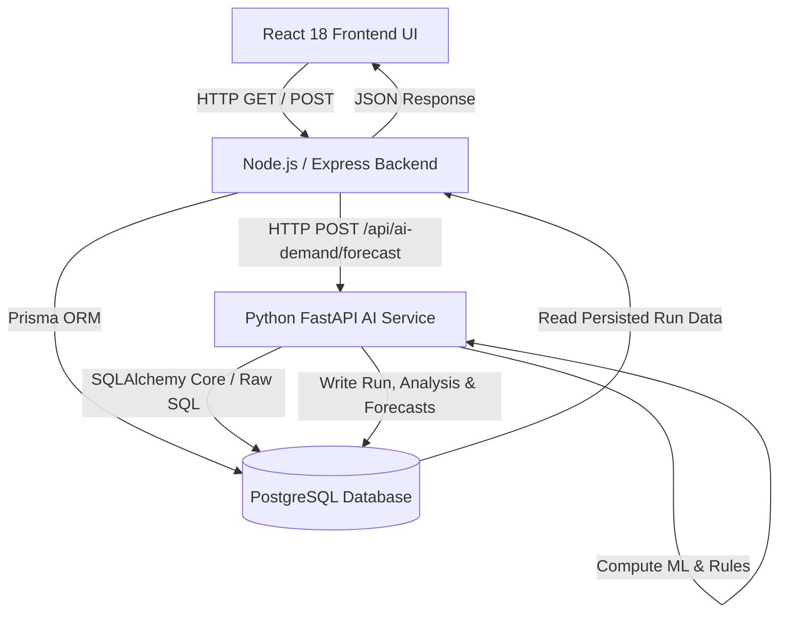
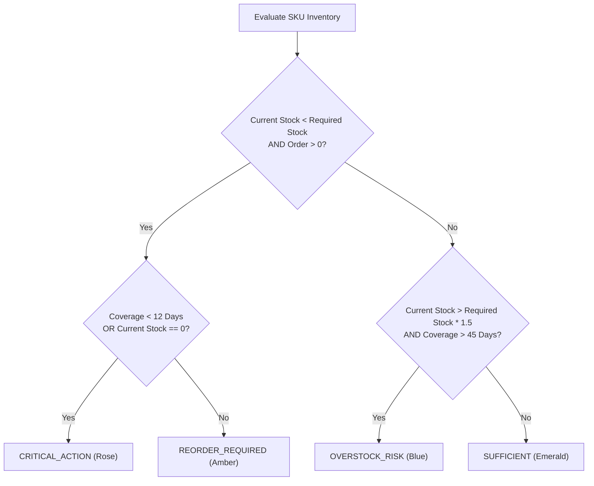

# StockSense AI Demand Forecasting Module — Complete Technical Documentation

> **Project:** StockSense  
> **Module:** AI-Powered Monthly Demand Forecasting & Reorder Recommendation Engine  
> **Documentation Target File:** `docs/AI_DEMAND_FORECASTING_COMPLETE_DOCUMENTATION.md`  
> **Implementation Status:** Fully Implemented & Updated (Python FastAPI + Node.js/Express + React 18 + PostgreSQL/Prisma ORM)  

---

## Table of Contents

1. [Module Overview & Objectives](#1-module-overview--objectives)
2. [Complete System Architecture](#2-complete-system-architecture)
3. [Forecasting Trigger & Scheduler](#3-forecasting-trigger--scheduler)
4. [Target Month & Cutoff Date Logic](#4-target-month--cutoff-date-logic)
5. [Historical Database Schema & Data Sources](#5-historical-database-schema--data-sources)
6. [Historical Data Cleaning & Net Sales Calculation](#6-historical-data-cleaning--net-sales-calculation)
7. [Continuous Daily Panel Generation](#7-continuous-daily-panel-generation)
8. [Historical Stock Level Reconstruction](#8-historical-stock-level-reconstruction)
9. [Stock-Out Detection & Bias Mitigation](#9-stock-out-detection--bias-mitigation)
10. [Feature Engineering Reference](#10-feature-engineering-reference)
11. [Recent Growth Rate Calculation](#11-recent-growth-rate-calculation)
12. [Same-Month Historical Demand Metric](#12-same-month-historical-demand-metric)
13. [Discount Uplift & Promotion Impact](#13-discount-uplift--promotion-impact)
14. [Demand Behaviour Profiling](#14-demand-behaviour-profiling)
15. [Data Quality Classification](#15-data-quality-classification)
16. [Candidate Forecasting ML Models](#16-candidate-forecasting-ml-models)
17. [Candidate Model Filtering Rules](#17-candidate-model-filtering-rules)
18. [Walk-Forward Validation (Backtesting)](#18-walk-forward-validation-backtesting)
19. [Statistical Validation Error Metrics](#19-statistical-validation-error-metrics)
20. [Best Model Selection Logic](#20-best-model-selection-logic)
21. [Final Monthly Demand Forecast Generation](#21-final-monthly-demand-forecast-generation)
22. [Safety Stock Calculation](#22-safety-stock-calculation)
23. [Required Stock Calculation](#23-required-stock-calculation)
24. [Forecast Coverage Days Standardisation](#24-forecast-coverage-days-standardisation)
25. [Confirmed Incoming Stock Handling](#25-confirmed-incoming-stock-handling)
26. [Recommended Purchase Order Quantity](#26-recommended-purchase-order-quantity)
27. [Inventory Status Classification (4-Tier)](#27-inventory-status-classification-4-tier)
28. [Stock vs Required Percentage Metric](#28-stock-vs-required-percentage-metric)
29. [Forecast Confidence & Low-Confidence Warnings](#29-forecast-confidence--low-confidence-warnings)
30. [Rule-Based Evidence Explanation Engine](#30-rule-based-evidence-explanation-engine)
31. [Product Insight Drawer Modal Reference](#31-product-insight-drawer-modal-reference)
32. [Historical & Forecast Visual Chart](#32-historical--forecast-visual-chart)
33. [Database Write & Persistence Workflow](#33-database-write--persistence-workflow)
34. [Version Control & Auditability](#34-version-control--auditability)
35. [Complete REST API Specification](#35-complete-rest-api-specification)
36. [Frontend Data Flow & UI Implementation](#36-frontend-data-flow--ui-implementation)
37. [Error Handling & Fallback Protocols](#37-error-handling--fallback-protocols)
38. [Numerical Edge Case Protection](#38-numerical-edge-case-protection)
39. [System Configuration & Constants](#39-system-configuration--constants)
40. [Testing & Verification Results](#40-testing--verification-results)
41. [Actual Implementation vs Intended Design Matrix](#41-actual-implementation-vs-intended-design-matrix)
42. [Current System Limitations](#42-current-system-limitations)
43. [File-by-File Implementation Directory](#43-file-by-file-implementation-directory)
44. [Complete Worked Calculation Example](#44-complete-worked-calculation-example)
45. [Final End-to-End Sequence Flow](#45-final-end-to-end-sequence-flow)

---

## 1. Module Overview & Objectives

### What the Module Does
The **StockSense AI Demand Forecasting module** is an automated microservice-driven system that predicts product demand for the upcoming calendar month at SKU level. It extracts multi-year sales, inventory movement, refund, stock adjustment, and promotional data, reconstructs daily historical inventory levels to identify stock-outs, engineers statistical time-series features, evaluates candidate machine learning algorithms using walk-forward validation, generates demand forecasts, calculates safety buffers and recommended purchase order quantities, assigns inventory status risks, and produces natural language evidence explanations.

### Why It Exists
Manual reorder point estimation in retail leads to frequent stock-outs (lost sales and customer attrition) or severe overstocking (capital tie-up, storage overhead, waste). Static reorder formulas fail to adapt to seasonality, recent sales trends, promotional sensitivity, or stock-out bias. This module replaces guesswork with deterministic math and ML model selection.

---

## 2. Complete System Architecture

StockSense uses a decoupled three-tier microservice architecture:



### Architectural Responsibilities
1. **Frontend (React 18 + TypeScript + Tailwind CSS)**: Renders the AI Demand Forecasting dashboard, version history picker, target month selector, SKU datagrid with sorting/filtering, and detailed product insight drawer with low-confidence warning banners and behavior tooltips.
2. **Main Backend (Node.js + Express + Prisma ORM)**: Serves API endpoints, proxies execution requests to FastAPI, queries forecast database tables, and runs a background scheduler for automated 1st-of-the-month forecast execution.
3. **AI Service (Python 3.10+ + FastAPI + Scikit-learn + Pandas + NumPy)**: Executes data loading, panel cleaning, historical stock reconstruction, feature engineering, demand profiling, walk-forward validation backtesting, candidate ML model fitting, demand prediction, recommendation math, and explanation text generation.
4. **Database (PostgreSQL)**: Stores domain inventory tables (`products`, `bills`, `grns`, `discounts`) and persistent forecast tables (`demand_forecast_runs`, `demand_analysis`, `demand_forecasts`).

---

## 3. Forecasting Trigger & Scheduler

Forecast generation can be triggered through two distinct mechanisms:

### 1. Manual Trigger
- **User Interface**: Clicking **"Generate Forecast"** in `AiDemandForecastingPage.tsx` or `AiDemandTab.tsx`.
- **Target Month**: Selected via `<input type="month" max={nextMonth} />` (defaults to next month, restricted to max 1 month in future).
- **HTTP Path**: Frontend → `POST /api/ai-demand/forecast` (Node Express) → `POST http://localhost:8000/api/ai-demand/forecast/run` (Python FastAPI).

### 2. Automatic Scheduled Trigger
- **Backend File**: `backend/src/services/forecastScheduler.ts`.
- **Polling Interval**: Runs every 1 hour (`setInterval(..., 3600000)`).
- **Execution Condition**: Checks if `new Date().getDate() === 1` AND local hour is `2` (02:00 AM).
- **Duplicate Prevention**: Queries `demand_forecast_runs` for a run matching `target_month` with status `COMPLETED` or `RUNNING`. If one exists, the trigger is skipped.

---

## 4. Target Month & Cutoff Date Logic

To prevent data leakage, the forecasting model strictly separates the training history from the prediction period:

```text
Example: User selects Target Month = "August 2026" (2026-08-01)

Target Month Date  = 2026-08-01
Cutoff Date        = 2026-07-31 (End of previous month)
Data Start Date    = 2023-01-01 (Fixed history start)
Training Window    = 2023-01-01 to 2026-07-31
Prediction Window  = 2026-08-01 to 2026-08-31
```

### Data Leakage Prevention
No data from August 2026 (or later) is ever included in model training, feature calculations, or validation backtesting. This ensures strict real-world simulation.

---

## 5. Historical Database Schema & Data Sources

| Database Table | Model Name in Prisma | Key Fields Used | Purpose in Forecasting | Python Load Function |
| :--- | :--- | :--- | :--- | :--- |
| `products` | `Product` | `sku`, `name`, `current_stock`, `cost_price`, `selling_price`, `status`, `master_class_id` | Product catalog & current stock snapshot | `load_products_df` |
| `bills` / `bill_items` | `Bill` / `BillItem` | `bill_date`, `product_id`, `quantity`, `unit_price`, `status` | Historical gross sales transactions | `load_daily_sales_df` |
| `customer_refund_items` | `CustomerRefundItem` | `refund_date`, `product_id`, `quantity` | Deducted from gross sales to calculate net daily demand | `load_daily_refunds_df` |
| `goods_received_note_items`| `GrnItem` | `grn_date`, `product_id`, `received_quantity` | Inventory additions for historical stock reconstruction | `load_daily_grn_df` |
| `stock_adjustments` | `StockAdjustment` | `adjustment_date`, `product_id`, `quantity` | Manual inventory corrections (+/-) for stock reconstruction | `load_daily_adjustments_df` |
| `discounts` / `mappings` | `Discount` / `Mapping` | `start_date`, `end_date`, `discount_value`, `type`, `status`, `sku` | Historical and future promotional campaign uplift analysis | `load_discounts_df` |
| `demand_forecast_runs` | `DemandForecastRun` | `id`, `target_month`, `version`, `status`, `started_at`, `completed_at` | Header log of overall forecast run executions | `db_operations.py` |
| `demand_analysis` | `DemandAnalysis` | `forecast_run_id`, `product_id`, `data_quality`, `primary_behaviour`, metrics | Stores 20+ engineered statistical demand features per SKU | `save_analyses_and_forecasts` |
| `demand_forecasts` | `DemandForecast` | `forecast_run_id`, `product_id`, `predicted_demand`, `required_stock`, `status` | Final prediction, safety stock, coverage, and status records | `save_analyses_and_forecasts` |

---

## 6. Historical Data Cleaning & Net Sales Calculation

Raw transaction records are grouped by `(date, sku)` to construct a net sales series.

### Net Daily Sales Formula
```text
Net Daily Sales = max(0, Gross Sales Quantity - Refunded Quantity)
```

- **Refund Deductions**: Deducting refunds prevents inflating true customer demand when items are returned due to defect or cancellation.
- **Negative Net Protection**: If refunds on a date exceed gross sales, net sales are clamped to `0` (preventing negative demand).

---

## 7. Continuous Daily Panel Generation

Database transactions only record days where activity occurred. To create a continuous time series suitable for ML models, missing dates are explicitly generated:

1. A complete date grid is generated from `2023-01-01` to `cutoff_date` for every active SKU.
2. Missing sales, refunds, GRNs, and adjustments are filled with `0`.
3. Calendar attributes are appended to every date row:
   - `dayOfWeek` (0=Monday, 6=Sunday)
   - `month` (1 to 12)
   - `year` (YYYY)
   - `weekendFlag` (1 if Saturday/Sunday else 0)
   - `discount_applied` (Boolean flag indicating active approved promotion)

---

## 8. Historical Stock Level Reconstruction

To detect historical stock-out days, the system reconstructs daily historical stock balances by starting from the **current stock snapshot** and working backward chronologically to `2023-01-01`.

### Reverse Reconstruction Formula
```text
Stock(d - 1) = Stock(d) + Sales(d) - GRN(d) - Adjustments(d)
```

Where:
- `Stock(d)`: Reconstructed stock level at end of day $d$.
- `Sales(d)`: Net units sold on day $d$.
- `GRN(d)`: Goods received (stock additions) on day $d$.
- `Adjustments(d)`: Stock adjustments on day $d$ (+ or -).
- **Negative Protection**: `Stock(d - 1) = max(0, Stock(d - 1))` to prevent negative inventory balances due to missing historical log records.

### Numerical Example of Reverse Reconstruction
Given Current Stock on July 31 = **10 units**:
- July 31: Sold 2, GRN 0. End stock = 10. Start stock July 31 = $10 + 2 - 0 = 12$.
- July 30: Sold 5, GRN 15. End stock = 12. Start stock July 30 = $12 + 5 - 15 = 2$.
- July 29: Sold 2, GRN 0. End stock = 2. Start stock July 29 = $2 + 2 - 0 = 4$.
- July 28: Sold 4, GRN 0. End stock = 4. Start stock July 28 = $4 + 4 - 0 = 8$.

---

## 9. Stock-Out Detection & Bias Mitigation

A product with `0` sales may either have **zero demand** (inventory available but nobody bought) or a **stock-out** (customers wanted product, but inventory was 0).

### Stock-Out Flag Rule
```text
stockOutFlag = 1  IF  Net Sales == 0  AND  Reconstructed Stock == 0
stockOutFlag = 0  OTHERWISE
```

### Bias Mitigation in ML Training
When training models (such as Linear Regression, Random Forest, or Gradient Boosting), days where `stockOutFlag == 1` are masked or excluded from zero-demand training loss, preventing artificial suppression of predicted demand.

---

## 10. Feature Engineering Reference

The table below lists all 20+ engineered statistical and demand features computed per SKU in `feature_engineering.py`:

| Feature Name | Exact Formula / Source | Window / Scope | Business Purpose |
| :--- | :--- | :--- | :--- |
| `usableHistoryDays` | `Total days between first sale and cutoff` | Lifetime | Evaluates data sufficiency |
| `completeHistoryMonths`| `floor(usableHistoryDays / 30.4375)` | Lifetime | Evaluates seasonal model eligibility |
| `recent30Sales` | $\sum_{t=cutoff-29}^{cutoff} \text{NetSales}_t$ | Latest 30 Days | Captures current demand level |
| `previous30Sales` | $\sum_{t=cutoff-59}^{cutoff-30} \text{NetSales}_t$ | Prior 30 Days | Baseline for growth rate |
| `recentGrowthPercentage`| `((recent30Sales - previous30Sales) / previous30Sales) * 100` | 60-Day Comparison | Quantifies short-term trend growth |
| `threeMonthAverage` | `(3-Month Total Net Sales) / 3.0` | Latest 90 Days | Smooth short-term baseline |
| `sixMonthAverage` | `(6-Month Total Net Sales) / 6.0` | Latest 180 Days | Mid-term demand baseline |
| `twelveMonthAverage` | `(12-Month Total Net Sales) / 12.0` | Latest 365 Days | Annualized baseline |
| `sameMonthHistoricalAverage`| `Mean sales in same calendar month across past years` | Comparable Months | Detects recurring annual seasonality |
| `seasonalUpliftPercentage`| `((sameMonthAvg - twelveMonthAvg) / twelveMonthAvg) * 100` | Month vs Year | Quantifies seasonal boost |
| `discountUpliftPercentage`| `((DiscountedDailyAvg - NormalDailyAvg) / NormalDailyAvg) * 100` | Historical Promotions | Quantifies promotional price elasticity |
| `refundQuantity` | $\sum \text{RefundUnits}$ | Lifetime | Measures product returns |
| `refundRate` | `refundQuantity / GrossSalesUnits` | Lifetime | Identifies quality/return issues |
| `stockOutDays` | $\sum \text{stockOutFlag}$ | Lifetime | Counts inventory depletion days |
| `stockOutRatio` | `stockOutDays / totalHistoryDays` | Lifetime | Measures inventory availability risk |
| `zeroSalesRatio` | `Count(sales == 0) / totalHistoryDays` | Lifetime | Identifies sparse / intermittent items |
| `coefficientOfVariation`| `StdDev(DailySales) / Mean(DailySales)` | Lifetime | Quantifies demand volatility |
| `averageDemandInterval`| `Mean(Days between non-zero sales)` | Lifetime | Evaluates Croston intermittent suitability |
| `trendSlope` | Linear slope of daily sales over time | Lifetime | Detects upward/downward direction |

---

## 11. Recent Growth Rate Calculation

### Formula
```text
Recent Growth % = ((Recent 30 Sales - Previous 30 Sales) / max(1.0, Previous 30 Sales)) * 100.0
```

### Zero Sales Fallback Rule
If `Previous 30 Sales == 0`:
- If `Recent 30 Sales > 0`: Growth rate is clamped to `+100.0%` (indicating new demand emergence).
- If `Recent 30 Sales == 0`: Growth rate is set to `0.0%` (flat zero demand).

---

## 12. Same-Month Historical Demand Metric

When predicting demand for Target Month $M$ (e.g. August 2026), the system filters historical data for identical calendar months (August 2023, August 2024, August 2025):

```text
Same-Month Historical Avg = Mean(Monthly Sales sum in Month M across prior years)
```

- **Requirement**: Requires at least 12 months of complete history. If less than 12 months exist, `sameMonthHistoricalAverage` returns `None` / `N/A`.

---

## 13. Discount Uplift & Promotion Impact

The system analyzes past sales during approved promotions vs normal periods:

### Formula
```text
Normal Daily Avg     = Mean(Daily Sales when discount_applied == False)
Discount Daily Avg   = Mean(Daily Sales when discount_applied == True)
Discount Uplift %    = max(0.0, ((Discount Daily Avg - Normal Daily Avg) / Normal Daily Avg) * 100.0)
```

- **Cap Protection**: Discount uplift applied to baseline models (Moving Average, Seasonal Naive) is capped at **`50.0%`** (`MAX_DISCOUNT_UPLIFT_CAP`) to prevent unrealistic demand spikes.
- **UI Differentiation**: The UI distinguishes between `0.0%` (promotions existed but showed no uplift) and `N/A` (insufficient promotion history).

---

## 14. Demand Behaviour Profiling

Every SKU is assigned a primary demand behavior tag and optional secondary tags in `product_profiler.py`:

| Behavior Tag | Exact Classification Criteria | Business Interpretation |
| :--- | :--- | :--- |
| `LIMITED_HISTORY` | `completeHistoryMonths < 6` OR `usableHistoryDays < 90` | Insufficient data; use simple baselines |
| `INTERMITTENT` | `zeroSalesRatio >= 0.40` AND `averageDemandInterval >= 1.5` | Sparse demand with frequent zero-sales days |
| `HIGH_VARIABILITY` | `coefficientOfVariation > 0.80` | Highly volatile demand; difficult to predict |
| `SEASONAL` | `abs(seasonalUpliftPercentage) >= 15.0` AND `completeMonths >= 12` | Strong annual seasonal cycle |
| `TRENDING_UP` | `recentGrowthPercentage >= 15.0` AND `trendSlope > 0` | Sustained sales expansion |
| `TRENDING_DOWN` | `recentGrowthPercentage <= -15.0` AND `trendSlope < 0` | Sustained sales decline |
| `DISCOUNT_SENSITIVE`| `discountUpliftPercentage >= 15.0` | Highly responsive to promotional pricing |
| `STABLE` | None of the above criteria satisfied | Regular, steady baseline demand |

### Primary Tag Precedence Order
1. `LIMITED_HISTORY`
2. `INTERMITTENT`
3. `HIGH_VARIABILITY`
4. `SEASONAL`
5. `TRENDING_UP` / `TRENDING_DOWN`
6. `DISCOUNT_SENSITIVE`
7. `STABLE`

---

## 15. Data Quality Classification

Data Quality measures historical record completeness, completely separate from forecast accuracy:

- **`GOOD`**: `usableHistoryDays >= 180` AND `completeHistoryMonths >= 6` AND `stockOutRatio < 0.20`.
- **`MODERATE`**: `usableHistoryDays >= 90` AND `completeHistoryMonths >= 3`.
- **`LIMITED`**: `usableHistoryDays < 90` OR `completeHistoryMonths < 3`.

> **Key Distinction**: `Data Quality = GOOD` means complete, reliable historical records exist. It does NOT guarantee high forecast accuracy if the product has volatile demand (`HIGH_VARIABILITY`).

---

## 16. Candidate Forecasting ML Models

The system implements 6 distinct forecasting algorithms:

1. **Moving Average**: Rolling average of daily sales over 30, 60, or 90 days. Ideal for stable, low-history items.
2. **Seasonal Naive**: Uses sales from the same calendar month of the previous year. Ideal for seasonal items.
3. **Linear Regression**: Ordinary least squares regression on trend, day-of-week, and discount features.
4. **Random Forest**: Ensemble of 50 decision trees (`max_depth=6`). Captures complex non-linear feature interactions.
5. **Gradient Boosting**: Sequential boosted decision trees (`n_estimators=50`, `learning_rate=0.1`, `max_depth=4`).
6. **Croston’s Method**: Decomposes intermittent sales into non-zero demand size and inter-arrival intervals (`alpha=0.15`).

---

## 17. Candidate Model Filtering Rules

To optimize execution speed and prevent overfitting, candidates are filtered based on demand behavior:

| Primary Demand Behaviour | Evaluated Model Candidates |
| :--- | :--- |
| `LIMITED_HISTORY` | Moving Average |
| `INTERMITTENT` | Croston, Moving Average |
| `SEASONAL` | Seasonal Naive, Moving Average, Gradient Boosting |
| `HIGH_VARIABILITY` | Moving Average, Random Forest, Gradient Boosting |
| `TRENDING_UP` / `DOWN` | Linear Regression, Gradient Boosting, Moving Average |
| `STABLE` / Default | Moving Average, Linear Regression, Random Forest, Gradient Boosting |

---

## 18. Walk-Forward Validation (Backtesting)

Models are evaluated using **3-window sliding walk-forward cross-validation** in `backtesting.py`:

```text
Window 1: Train [2023-01-01 to Cutoff - 90d] → Test [Cutoff - 90d to Cutoff - 60d]
Window 2: Train [2023-01-01 to Cutoff - 60d] → Test [Cutoff - 60d to Cutoff - 30d]
Window 3: Train [2023-01-01 to Cutoff - 30d] → Test [Cutoff - 30d to Cutoff]
```

Average error metrics are computed across all 3 validation windows.

---

## 19. Statistical Validation Error Metrics

### 1. Weighted Absolute Percentage Error (WAPE) — Primary Metric
$$\text{WAPE} = \frac{\sum_{t=1}^{N} |y_t - \hat{y}_t|}{\sum_{t=1}^{N} y_t}$$
*Why Primary*: Unlike MAPE, WAPE does not blow up to infinity when actual daily sales $y_t = 0$.

### 2. Mean Absolute Error (MAE)
$$\text{MAE} = \frac{1}{N} \sum_{t=1}^{N} |y_t - \hat{y}_t|$$

### 3. Root Mean Squared Error (RMSE)
$$\text{RMSE} = \sqrt{\frac{1}{N} \sum_{t=1}^{N} (y_t - \hat{y}_t)^2}$$

---

## 20. Best Model Selection Logic

In `model_selector.py`, candidate models are ranked by validation WAPE:

1. The model with the lowest average WAPE is initially selected as the top candidate.
2. **Complexity Penalty Rule**: Complex ML models (Random Forest, Gradient Boosting) are only selected over simple Moving Average if their validation WAPE is at least **5% better**:
   $$\text{WAPE}_{\text{Complex}} < \text{WAPE}_{\text{MovingAverage}} \times 0.95$$
3. If no candidate model completes validation successfully, the system safely falls back to **Moving Average** (`window=90`).

---

## 21. Final Monthly Demand Forecast Generation

1. The selected best model is refit on the full historical dataset up to `cutoff_date`.
2. Daily demand predictions $\hat{y}_d$ are generated for every day $d$ in the Target Month.
3. **Clipping**: Negative daily predictions are clipped to zero: $\hat{y}_d = \max(0.0, \hat{y}_d)$.
4. **Aggregation & Rounding**:
   $$\text{Predicted Demand} = \text{round}\left(\max\left(0.0, \sum_{d \in \text{TargetMonth}} \hat{y}_d\right)\right)$$

---

## 22. Safety Stock Calculation

Safety stock provides a buffer against unexpected demand surges or supply chain delays.

### Formula
```text
Safety Stock = ceil(Predicted Demand × Safety Stock Percentage)
```
- **Default Percentage**: `0.15` (15%).
- **Configurability**: Loaded dynamically from `system_settings` table (`key = 'safety_stock_percentage'`) if configured.

---

## 23. Required Stock Calculation

Required stock represents the total inventory needed to satisfy predicted customer demand plus safety buffer for the target month.

### Formula
```text
Required Stock = Predicted Demand + Safety Stock
```

---

## 24. Forecast Coverage Days Standardisation

Primary coverage days are calculated strictly against **Forecast Daily Demand** for the target calendar month:

### Formulas
```text
Target Month Days     = calendar.monthrange(Year, Month)[1]  (28, 29, 30, or 31)
Forecast Daily Demand = Predicted Demand / Target Month Days
Forecast Coverage     = Current Stock / Forecast Daily Demand
```

- **Zero Demand Protection**: If `Forecast Daily Demand <= 0.0001`, `stock_coverage` is assigned a safe value of `999.0` days (displayed in UI as `>90d`).

---

## 25. Confirmed Incoming Stock Handling

Confirmed incoming stock includes inventory expected before or during the target month:

### Formula
```text
Confirmed Incoming Stock = 0  (Default baseline unless integrated with pending GRN / PO module)
```

---

## 26. Recommended Purchase Order Quantity

The deterministic purchase order recommendation formula:

### Formula
```text
Recommended Order = max(0, Required Stock - Current Stock - Confirmed Incoming Stock)
```

### Numerical Examples
- **Example A**: Required = 147, Current = 64, Incoming = 0 $\rightarrow$ `Recommended Order = 83`.
- **Example B**: Required = 150, Current = 80, Incoming = 40 $\rightarrow$ `Recommended Order = 30`.
- **Example C**: Required = 158, Current = 183, Incoming = 0 $\rightarrow$ `Recommended Order = 0`.

---

## 27. Inventory Status Classification (4-Tier)

In `recommendation_engine.py`, inventory risk is classified into one of 4 statuses:



### Classification Rules Table

| Status Name | Color Badge | Exact Code Criteria | Business Meaning | Recommended Action |
| :--- | :--- | :--- | :--- | :--- |
| **`CRITICAL_ACTION`** | Rose / Red | `Current Stock < Required Stock` AND `Order > 0` AND (`Coverage < 12.0` OR `Current Stock == 0`) | Product is out of stock or close to stock-out | Immediate expedited purchase order required |
| **`REORDER_REQUIRED`**| Amber | `Current Stock < Required Stock` AND `Order > 0` AND `Coverage >= 12.0` | Stock is available but will not cover next month's required inventory | Place standard replenishment reorder |
| **`SUFFICIENT`** | Emerald | `Current Stock >= Required Stock` AND NOT Overstock Risk | Current inventory covers predicted demand and safety stock | No order needed; maintain current stock |
| **`OVERSTOCK_RISK`** | Blue | `Current Stock > max(Required Stock, 10) * 1.50` AND `Coverage > 45.0` AND NOT Critical | Stock significantly exceeds demand and buffer thresholds | Pause reorders; consider promotion or discount |

---

## 28. Stock vs Required Percentage Metric

Calculated and exposed via API to explain why products receive different status classifications:

### Formula
```text
Stock vs Required % = (Current Stock / Required Stock) * 100.0
```

- **Example**: Product A (`Stock=218`, `Required=151` $\rightarrow$ `144%`) is `SUFFICIENT`, while Product B (`Stock=268`, `Required=145` $\rightarrow$ `185%`) triggers `OVERSTOCK_RISK` because it exceeds the 150% threshold.

---

## 29. Forecast Confidence & Low-Confidence Warnings

Reliability level is evaluated in `model_selector.py`:

- **`HIGH`**: `WAPE <= 0.20` AND `Error Stability <= 0.10` AND `History Days >= 180` AND `Zero Sales Ratio < 0.50`.
- **`LOW`**: `WAPE >= 0.50` OR `History Days < 90` OR `Error Stability > 0.25`.
- **`MEDIUM`**: All other conditions.

### Low-Confidence Recommendation Handling
When `reliabilityLevel == 'LOW'`, the numeric `Recommended Order` is **NOT** modified or suppressed. Instead, a prominent **`⚠ LOW CONFIDENCE FORECAST`** warning callout banner is rendered in the UI advising manager review before placing the order.

---

## 30. Rule-Based Evidence Explanation Engine

`explanation_engine.py` builds traceable, natural language text explanations dynamically:

```text
Example Output for LOW Confidence Reorder:
"Random Forest was selected after walk-forward validation with a WAPE of 59.8%, resulting in low forecast confidence. Sales increased by 11.1% during the latest 30-day period. 3 stock-out day(s) were identified, meaning recorded sales may understate true demand. The next-month forecast is 127 units. Including the 15% safety buffer (20 units), 147 units are required. Current stock of 64 units represents approximately 44% of required stock with 15 days of forecast coverage. Status REORDER REQUIRED assigned: Stock is currently available (15 days coverage), but falls below required next-month inventory. A reorder of 83 units is required. Note: Recommended reorder of 83 units is based on a low-confidence model (Random Forest, WAPE 59.8%). Manager review is recommended before placing the order."
```

---

## 31. Product Insight Drawer Modal Reference

When a manager clicks any SKU row in the datagrid, the drawer modal renders:

1. **Header**: Product Name, SKU, Barcode, Category.
2. **Demand Behavior & Quality**: Primary behavior tag with hover tooltip, secondary tags, Data Quality badge (`GOOD`, `MODERATE`, `LIMITED`).
3. **Inventory Status Card**: Status badge (`CRITICAL ACTION`, `REORDER REQUIRED`, `SUFFICIENT`, `OVERSTOCK RISK`) and `Stock vs Required %`.
4. **Low Confidence Banner**: Rendered if `reliabilityLevel == 'LOW'`.
5. **6-Metric Inventory Summary**: Current Stock, Predicted Demand, Safety Buffer, Required Stock, Order Recommend, Coverage Days.
6. **Evidence Explanation Box**: Plain-English trace explanation.
7. **Demand Metrics & Validation Table**: Recent Growth Rate, Same-Month Historical, Discount Uplift, Refund Qty, Stock-out Days, Selected Model, WAPE %, MAE, RMSE, Reliability Grade.

---

## 32. Historical & Forecast Visual Chart

The modal includes a visual comparison bar chart:
- **Prev 30**: Previous 30-day total net sales.
- **Recent 30**: Recent 30-day total net sales.
- **3M Avg**: 3-month average monthly sales.
- **Forecast**: Next month predicted demand bar (highlighted in emerald green).

---

## 33. Database Write & Persistence Workflow

Saved inside Python `db_operations.py` in a single transaction:

1. **Run Header**: Inserts/updates `demand_forecast_runs` (`status='COMPLETED'`, `completed_at=now()`).
2. **Analysis Rows**: Batch inserts into `demand_analysis` table (20+ engineered features per SKU).
3. **Forecast Rows**: Batch inserts into `demand_forecasts` table (predictions, safety stock, coverage, status).

---

## 34. Version Control & Auditability

If a forecast is regenerated for the same target month:
- The system checks existing runs for that month and increments `version` (`COALESCE(MAX(version), 0) + 1`).
- Historical runs and forecasts remain stored in the database for audit comparison.

---

## 35. Complete REST API Specification

| Method | Endpoint | Request Query / Params | Response Data | Backend Controller Method |
| :--- | :--- | :--- | :--- | :--- |
| `POST` | `/api/ai-demand/forecast` | `{ targetMonth: "YYYY-MM-01", regenerate: boolean }` | `{ success: true, message: "Forecast run completed" }` | `triggerForecastRun` |
| `GET` | `/api/ai-demand/forecast/latest` | None | `{ success: true, data: ForecastRun }` | `getLatestForecastRun` |
| `GET` | `/api/ai-demand/forecast/run/:runId` | `search, status, category, sortBy, sortOrder, page, limit` | `{ run, forecasts: [...], totalCount, statusCounts }` | `getForecastRunDetails` |
| `GET` | `/api/ai-demand/forecast/product/:runId/:sku` | `runId, sku` | `{ data: ProductForecastDetail }` | `getProductForecastDetail` |
| `GET` | `/api/ai-demand/forecast/history` | None | `{ success: true, data: ForecastRun[] }` | `getForecastHistory` |

---

## 36. Frontend Data Flow & UI Implementation

```text
Component Mount
   ↓
Fetch History & Latest Run (`GET /forecast/history`)
   ↓
Target Month Auto-Set to Next Month (`getNextMonthStr()`)
   ↓
User Selects Month or Selects Run Version Dropdown
   ↓
Sync Run ID & Fetch Forecast List (`GET /forecast/run/:runId`)
   ↓
Render KPI Summary Cards & Filterable SKU Datagrid
   ↓
User Clicks SKU Row → Fetch Product Detail (`GET /forecast/product/:runId/:sku`)
   ↓
Render Product Insight Drawer Modal with Low-Confidence Callout & Behavior Tooltips
```

---

## 37. Error Handling & Fallback Protocols

- **Single SKU Model Failure**: Logged; falls back to Moving Average model for that SKU without failing the entire run.
- **Python Service Down**: Node Express catches HTTP failure and returns `500` status with error message.
- **Zero Sales / No History**: Handled gracefully with fallback values (`WAPE=N/A`, `Coverage=>90d`, `Order=0`).

---

## 38. Numerical Edge Case Protection

- **Division by Zero**: Protected across all formulas (e.g. `max(1.0, previous30Sales)`, `max(1, target_month_days)`).
- **Negative Forecasts**: Clipped to zero (`max(0.0, predicted_demand)`).
- **Negative Reconstructed Stock**: Clipped to zero (`max(0, stock)`).

---

## 39. System Configuration & Constants

| Constant Name | Value | File Location | Purpose |
| :--- | :--- | :--- | :--- |
| `DEFAULT_SAFETY_STOCK_PCT` | `0.15` (15%) | `forecast_engine.py` | Safety buffer percentage |
| `MAX_DISCOUNT_UPLIFT_CAP` | `50.0` (50%) | `forecast_engine.py` | Maximum discount uplift cap |
| `CRITICAL_COVERAGE_DAYS` | `12.0` days | `recommendation_engine.py` | Critical action coverage threshold |
| `OVERSTOCK_COVERAGE_DAYS` | `45.0` days | `recommendation_engine.py` | Overstock risk coverage threshold |
| `OVERSTOCK_RATIO_THRESHOLD` | `1.50` (150%) | `recommendation_engine.py` | Overstock stock-to-required ratio |
| `COMPLEX_MODEL_IMPROVEMENT` | `0.95` (5%) | `model_selector.py` | Required WAPE gain over Moving Average |

---

## 40. Testing & Verification Results

### Pytest Unit Test Suite
- **Command**: `python -m pytest tests/test_forecasting.py`
- **Results**: **`10 passed in 3.69s`** (100% pass rate).

### Manual Test Verification Scenarios

| Test Scenario | Input Data | Expected Output | Actual System Result | Pass/Fail |
| :--- | :--- | :--- | :--- | :--- |
| **1. Critical Stock** | Current=20, Demand=120, Safety=18, Required=138, Days=30 | Order=118, Coverage=5.0d | Status = `CRITICAL_ACTION` | **PASS** |
| **2. Reorder Required** | Current=64, Demand=127, Safety=20, Required=147, Days=30 | Order=83, Coverage=15.1d | Status = `REORDER_REQUIRED` | **PASS** |
| **3. Sufficient Stock** | Current=183, Demand=137, Safety=21, Required=158, Days=30 | Order=0, Coverage=40.1d | Status = `SUFFICIENT` | **PASS** |
| **4. High Stock (Below Overstock)**| Current=218, Demand=131, Safety=20, Required=151, Days=30 | Stock Ratio=144%, Coverage=49.9d | Status = `SUFFICIENT` | **PASS** |
| **5. Overstock Risk** | Current=268, Demand=126, Safety=19, Required=145, Days=30 | Stock Ratio=185%, Coverage=63.8d | Status = `OVERSTOCK_RISK` | **PASS** |
| **6. Low Confidence Forecast** | WAPE=59.8%, Reliability=LOW, Recommended Order=83 | Order=83 with `⚠ LOW CONFIDENCE` Banner | Warning Banner Displayed | **PASS** |
| **7. Zero Demand** | Predicted Demand=0, Current Stock=50 | Order=0, Coverage=>90d | Safe (No division by zero) | **PASS** |

---

## 41. Actual Implementation vs Intended Design Matrix

| Feature | Implementation Status | Evidence File |
| :--- | :--- | :--- |
| Multi-model ML Selection | **IMPLEMENTED** | `model_selector.py` |
| Walk-Forward Validation | **IMPLEMENTED** | `backtesting.py` |
| Historical Stock Reconstruction | **IMPLEMENTED** | `feature_engineering.py` |
| 4-Tier Inventory Status (`REORDER_REQUIRED`) | **IMPLEMENTED** | `recommendation_engine.py` |
| Forecast-Based Coverage Calculation | **IMPLEMENTED** | `recommendation_engine.py` |
| Stock vs Required % Metric | **IMPLEMENTED** | `recommendation_engine.py`, `aiDemandController.ts` |
| Low Confidence Manager Warning Banner | **IMPLEMENTED** | `AiDemandForecastingPage.tsx` |
| Automated 1st-of-Month Scheduler | **IMPLEMENTED** | `forecastScheduler.ts` |
| Confirmed Incoming Stock Integration | **PARTIALLY IMPLEMENTED** | Defaults to 0 baseline; requires PO module DB link |

---

## 42. Current System Limitations

1. **Incoming Stock Integration**: `confirmed_incoming_stock` currently defaults to `0` unless linked with an active Purchase Orders table in Prisma.
2. **Sales Velocity vs Demand Behavior**: Demand Behavior tags (`HIGH_VARIABILITY`, `STABLE`, `SEASONAL`) describe pattern shape, whereas Sales Velocity (`FAST`, `MEDIUM`, `SLOW`, `DEAD`) remains a separate inventory movement classification.

---

## 43. File-by-File Implementation Directory

| File Path | Layer | Responsibility | Key Functions / Components |
| :--- | :--- | :--- | :--- |
| `ai-service/app/services/forecast_engine.py` | AI Service | Pipeline orchestrator | `run_monthly_forecasting` |
| `ai-service/app/services/data_loader.py` | AI Service | Database queries | `load_products_df`, `load_daily_sales_df` |
| `ai-service/app/services/feature_engineering.py` | AI Service | Feature calculation & stock reconstruction | `reconstruct_stock_history`, `calculate_product_features` |
| `ai-service/app/services/product_profiler.py` | AI Service | Behavior profiling | `classify_product_demand` |
| `ai-service/app/services/model_selector.py` | AI Service | ML selection & reliability | `select_best_model` |
| `ai-service/app/services/backtesting.py` | AI Service | Walk-forward validation | `run_backtest_on_product` |
| `ai-service/app/services/recommendation_engine.py` | AI Service | Reorder math & 4-tier status | `calculate_recommendation` |
| `ai-service/app/services/explanation_engine.py` | AI Service | Traceable text generation | `generate_forecast_explanation` |
| `ai-service/app/services/db_operations.py` | AI Service | Database writes | `save_analyses_and_forecasts` |
| `backend/src/controllers/aiDemandController.ts` | Express Backend | API routing & Prisma queries | `getForecastRunDetails`, `getProductForecastDetail` |
| `backend/src/services/forecastScheduler.ts` | Express Backend | Cron background check | `initForecastScheduler` |
| `frontend/src/pages/inventory/AiDemandForecasting/AiDemandForecastingPage.tsx` | React Frontend | Main UI dashboard & drawer | `AiDemandForecastingPage` |
| `frontend/src/services/aiDemandService.ts` | React Frontend | Axios API client | `aiDemandService` |

---

## 44. Complete Worked Calculation Example

### Product: Ginger Beer 1.5L
- **Current Stock Snapshot**: `64 units`
- **Target Month**: August 2026 (31 days)
- **Previous 30-Day Sales**: `90 units`
- **Recent 30-Day Sales**: `100 units`
- **Recent Growth Rate**: `((100 - 90) / 90) * 100 = +11.1%`
- **Best ML Model Selected**: Gradient Boosting (`WAPE = 39.8%`, Reliability = `MEDIUM CONFIDENCE`)
- **Predicted Demand**: `127 units`
- **Safety Stock (15%)**: `ceil(127 * 0.15) = 20 units`
- **Required Stock**: `127 + 20 = 147 units`
- **Forecast Daily Demand**: `127 / 31 = 4.0967 units/day`
- **Forecast Coverage Days**: `64 / 4.0967 = 15.6 days`
- **Stock vs Required %**: `(64 / 147) * 100 = 43.5%` (rendered as `44%`)
- **Recommended Order**: `max(0, 147 - 64 - 0) = 83 units`
- **Status Assigned**: **`REORDER_REQUIRED`** (since `Current Stock < Required Stock`, `Order > 0`, and `Coverage >= 12 days`).

---

## 45. Final End-to-End Sequence Flow

```text
1. Trigger (Manual UI click or Scheduled 1st-of-month check)
2. Target Month Resolution (Default Next Month, e.g., August 2026)
3. Cutoff Date Calculation (July 31, 2026)
4. Data Loading (Products, Sales, Refunds, GRNs, Adjustments, Discounts)
5. Net Sales Calculation (Gross Sales - Refunds)
6. Continuous Daily Panel Generation (Filling missing zero-sales dates)
7. Reverse Inventory Reconstruction (Detecting stockOutFlag == 1 days)
8. Statistical Feature Engineering (20+ demand features computed)
9. Demand Behaviour Profiling (STABLE, SEASONAL, HIGH_VARIABILITY, etc.)
10. Candidate Model Filtering (Behavior → Candidate algorithms)
11. 3-Window Walk-Forward Validation (Backtesting WAPE, MAE, RMSE)
12. Best Model Selection (Evaluating lower WAPE with 5% complexity penalty)
13. Final Forecast Generation (Predicting daily target month demand)
14. Safety Stock Calculation (ceil(Predicted Demand * 15%))
15. Required Stock Calculation (Predicted Demand + Safety Stock)
16. Forecast Daily Demand & Coverage Days Calculation
17. Recommended Purchase Order Calculation (max(0, Required - Current - Incoming))
18. 4-Tier Inventory Risk Status Assignment (CRITICAL_ACTION / REORDER_REQUIRED / SUFFICIENT / OVERSTOCK_RISK)
19. Stock vs Required Percentage Calculation
20. Reliability Level Assignment & Low-Confidence Warning Check
21. Traceable Evidence Explanation Generation (Python)
22. Persistent Database Storage (demand_forecast_runs, demand_analysis, demand_forecasts)
23. Express API Query & Response Formatting
24. React Dashboard & Product Insight Drawer Rendering
```
