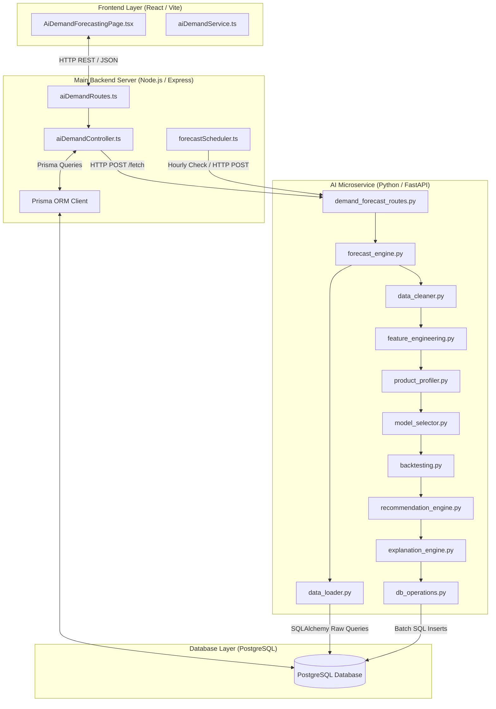
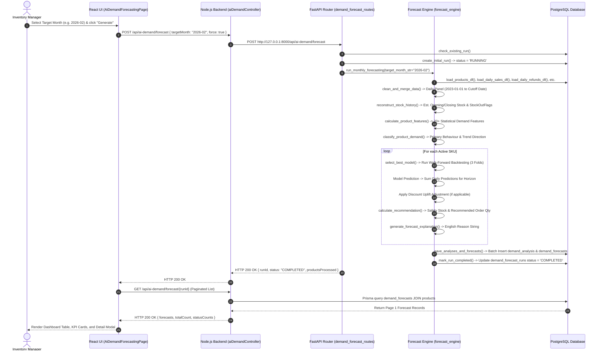
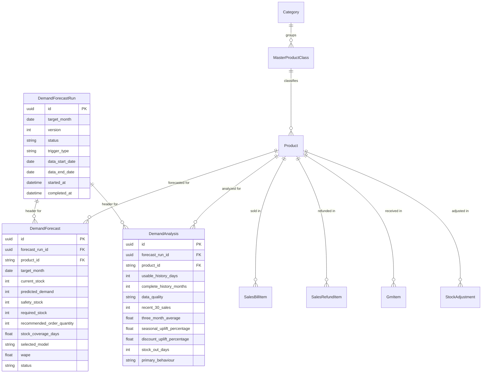

# AI Demand Forecasting Module — Complete Technical Documentation

> **Project:** StockSense  
> **Module Scope:** AI-Powered Monthly Demand Forecasting & Reorder Recommendation Engine  
> **Documentation Target:** `docs/AI_DEMAND_FORECASTING_COMPLETE_DOCUMENTATION.md`  
> **Documentation Basis:** Actual Codebase Implementation Analysis  
> **Architectural Layers:** Python FastAPI AI Service · Node.js/Express Backend · React Frontend · PostgreSQL/Prisma ORM  

---

## Table of Contents

1. [Project Discovery & File Map](#1-project-discovery--file-map)
2. [Executive Summary](#2-executive-summary)
3. [Implemented System Architecture](#3-implemented-system-architecture)
4. [Complete End-to-End Data Flow](#4-complete-end-to-end-data-flow)
5. [Database Schema and Data Sources](#5-database-schema-and-data-sources)
6. [Historical Data Preparation](#6-historical-data-preparation)
7. [Historical Stock Reconstruction](#7-historical-stock-reconstruction)
8. [Daily Panel Generation](#8-daily-panel-generation)
9. [Feature Engineering](#9-feature-engineering)
10. [Sales Velocity Classification](#10-sales-velocity-classification)
11. [Demand Behaviour Classification](#11-demand-behaviour-classification)
12. [Candidate Forecasting Models](#12-candidate-forecasting-models)
13. [Model Candidate Selection](#13-model-candidate-selection)
14. [Walk-Forward Validation](#14-walk-forward-validation)
15. [Error Metrics](#15-error-metrics)
16. [Best Model Selection](#16-best-model-selection)
17. [Final Demand Prediction](#17-final-demand-prediction)
18. [Discount and Promotion Impact](#18-discount-and-promotion-impact)
19. [Safety Stock Calculation](#19-safety-stock-calculation)
20. [Required Stock and Reorder Quantity](#20-required-stock-and-reorder-quantity)
21. [Inventory Status Classification](#21-inventory-status-classification)
22. [Explanation Engine](#22-explanation-engine)
23. [API Implementation](#23-api-implementation)
24. [Scheduler and Automation](#24-scheduler-and-automation)
25. [Frontend Implementation](#25-frontend-implementation)
26. [Versioning and Auditability](#26-versioning-and-auditability)
27. [Error Handling and Failure Recovery](#27-error-handling-and-failure-recovery)
28. [Testing](#28-testing)
29. [Security and Data Integrity](#29-security-and-data-integrity)
30. [Performance and Scalability](#30-performance-and-scalability)
31. [Actual Implementation vs Intended Design](#31-actual-implementation-vs-intended-design)
32. [Issues and Recommended Corrections](#32-issues-and-recommended-corrections)
33. [File-by-File Implementation Map](#33-file-by-file-implementation-map)
34. [Complete End-to-End Product Example](#34-complete-end-to-end-product-example)
35. [Final Presentation Summaries](#35-final-presentation-summaries)

---

## 1. Project Discovery & File Map

The StockSense project implements a decoupled, three-tier microservice architecture for AI Demand Forecasting. Inspection of the codebase reveals the following structure and environment setup:

*   **Frontend Framework**: React 18, TypeScript, Vite, Tailwind CSS (`frontend/src/`)
*   **Main Backend Framework**: Node.js, Express, TypeScript (`backend/src/`)
*   **AI/ML Microservice**: Python 3.10+, FastAPI, SQLAlchemy, Pandas, NumPy, Scikit-learn (`ai-service/app/`)
*   **Database & ORM**: PostgreSQL, Prisma ORM (`backend/prisma/schema.prisma`)
*   **API Communication**: Synchronous HTTP REST via Axios (`frontend` → `backend`) and HTTP REST via `fetch` (`backend` → `ai-service`)
*   **Scheduled Jobs**: Node.js interval-based scheduler (`backend/src/services/forecastScheduler.ts`)
*   **Environment Configuration**: Environment variables loaded via `.env` (`AI_SERVICE_URL`, `DATABASE_URL`, `PORT`)

### Key Keyword Search Results & Discovery Mapping

| Keyword | Found Location(s) | Implementation Role |
|---------|------------------|---------------------|
| `predicted_demand` / `predictedDemand` | `schema.prisma`, `forecast_engine.py`, `aiDemandController.ts`, `AiDemandForecastingPage.tsx` | Core output metric stored in DB and displayed in UI |
| `demand_forecast_runs` | `schema.prisma`, `db_operations.py`, `aiDemandController.ts` | Execution header logging run status, version, and date ranges |
| `demand_analysis` | `schema.prisma`, `db_operations.py`, `feature_engineering.py`, `product_profiler.py` | Per-product statistical analysis & behavior profile storage |
| `demand_forecasts` | `schema.prisma`, `db_operations.py`, `recommendation_engine.py` | Final SKU-level predictions, safety stock, and reorder quantities |
| `walk-forward` / `run_backtest_on_product` | `ai-service/app/services/backtesting.py` | 3-window sliding time-series cross-validation |
| `WAPE` / `MAE` / `RMSE` | `backtesting.py`, `model_selector.py` | Statistical error metrics for model evaluation |
| `Croston` | `ai-service/app/models/croston.py` | Specialized forecasting model for intermittent (sparse) demand |
| `Random Forest` | `ai-service/app/models/random_forest.py` | Ensemble ML regressor with 50 estimators, max depth 6 |
| `Gradient Boosting` | `ai-service/app/models/gradient_boosting.py` | Boosting ML regressor with 50 estimators, max depth 4 |
| `reconstruct_stock_history` | `ai-service/app/services/feature_engineering.py` | Reverse daily inventory calculation to detect stock-out days |
| `calculate_recommendation` | `ai-service/app/services/recommendation_engine.py` | Deterministic safety stock & purchase order logic |
| `generate_forecast_explanation` | `ai-service/app/services/explanation_engine.py` | Rule-based natural language justification string builder |

---

## 2. Executive Summary

### Functional Purpose
The AI Demand Forecasting module analyzes historical daily sales, inventory movements, customer refunds, and active discount promotions to predict SKU-level unit demand for an upcoming target month. It automatically evaluates current inventory levels against forecasted demand to recommend precise reorder quantities, calculate safety buffers, and categorize inventory risk levels.

### Business Value
In retail inventory management, stock-outs lead to lost revenue while overstocking ties up working capital and increases waste/spoilage. This module replaces static reorder thresholds with data-driven predictions that dynamically adapt to trend changes, seasonality, and promotional sales spikes.

### Implementation Status
- **Core Engine & ML Pipeline**: **Fully Implemented**. Complete pipeline from raw database ingestion to walk-forward model selection, prediction, safety stock calculation, and DB persistence.
- **REST APIs & Backend Proxy**: **Fully Implemented**. Node.js Express routes proxy requests to FastAPI, and query PostgreSQL via Prisma.
- **Frontend Dashboard**: **Fully Implemented**. Interactive React dashboard with filtering, search, pagination, status distribution cards, and single-SKU drill-down modal.
- **Automation / Scheduler**: **Partially Implemented**. Node.js background scheduler runs hourly checks for 1st-of-the-month triggers, but relies on process lifetime (no persistent cron daemon).

### 30-Second Presentation Pitch
> "Our AI Demand Forecasting module eliminates manual reorder guesswork. By combining statistical feature engineering with machine learning algorithms like Random Forest, Gradient Boosting, and Croston's method, it predicts next month's product demand. It dynamically selects the optimal model per SKU using walk-forward validation, adjusts for historical discount uplifts, and generates human-readable explanations—enabling inventory managers to make profit-safe purchase decisions in seconds."

---

## 3. Implemented System Architecture



### Layer Responsibilities

1. **Trigger Layer**:
   - `AiDemandForecastingPage.tsx` → `handleGenerateForecast()` initiates manual runs.
   - `forecastScheduler.ts` → `checkAndTriggerForecast()` executes hourly checks for 1st-of-month automated execution.
2. **Backend Proxy Layer (`backend/src/controllers/aiDemandController.ts`)**:
   - Receives request from frontend, validates payload, and sends HTTP POST to FastAPI (`http://127.0.0.1:8000/api/ai-demand/forecast`).
   - Serves cached forecast results directly from PostgreSQL via Prisma ORM for high-speed dashboard rendering without blocking Python GIL.
3. **AI Pipeline Layer (`ai-service/app/services/forecast_engine.py`)**:
   - Ingests raw data via SQLAlchemy (`data_loader.py`).
   - Merges sales, refunds, GRNs, and stock adjustments into a daily panel (`data_cleaner.py`).
   - Reconstructs historical daily stock levels backwards from current stock (`feature_engineering.py`).
   - Extracts 20+ demand features (`feature_engineering.py`).
   - Profiles SKU demand behavior (`product_profiler.py`).
   - Runs walk-forward validation across candidate models (`backtesting.py`, `model_selector.py`).
   - Calculates safety stock and purchase recommendations (`recommendation_engine.py`).
   - Generates English justifications (`explanation_engine.py`).
   - Writes batch results into `demand_forecast_runs`, `demand_analysis`, and `demand_forecasts` (`db_operations.py`).

---

## 4. Complete End-to-End Data Flow



### Detailed Step Breakdown

| Step | Action | Input Data | Output Data | Implementation File & Function | Validation / Safeguards |
|------|--------|------------|-------------|--------------------------------|------------------------|
| 1 | Trigger Run | Target Month string (`YYYY-MM`) | API Payload | `frontend/src/services/aiDemandService.ts → generateForecast()` | User role checked by Express auth middleware |
| 2 | Duplicate Check | `targetMonthDate` | Existing `runId` or `None` | `ai-service/app/services/db_operations.py → check_existing_run()` | Returns HTTP 400 if run exists unless `force=true` |
| 3 | Create Run Header | Dates, trigger type | `run_id` (UUID) | `db_operations.py → create_initial_run()` | Sets `status='RUNNING'`, increments version number |
| 4 | Load History | Database tables up to cutoff date | 7 Pandas DataFrames | `ai-service/app/services/data_loader.py → load_*_df()` | SQL cutoff filter `b.created_at <= :end_date` |
| 5 | Clean & Merge Panel | 7 Raw DataFrames | `cleaned_df` (Daily Panel) | `ai-service/app/services/data_cleaner.py → clean_and_merge_data()` | `net_qty = max(0, gross - refunds)` |
| 6 | Stock Reconstruction | `cleaned_df`, `current_stock` | Panel with `stockOutFlag` | `ai-service/app/services/feature_engineering.py → reconstruct_stock_history()` | Caps negative opening stock at 0 with warning flag |
| 7 | Feature Extraction | `cleaned_df < targetMonth` | `features_df` | `feature_engineering.py → calculate_product_features()` | Strictly filters `date < target_month_start` (no leakage) |
| 8 | Demand Profiling | `features_df` | Tagged `features_df` | `ai-service/app/services/product_profiler.py → classify_product_demand()` | Prioritized hierarchy (LIMITED_HISTORY → STABLE) |
| 9 | Model Selection | `prod_hist`, `primaryBehaviour` | Best fitted model instance | `ai-service/app/services/model_selector.py → select_best_model()` | 5% WAPE improvement penalty for complex ML models |
| 10 | Final Prediction | Future dates DataFrame | `predicted_demand` (int) | `ai-service/app/services/forecast_engine.py → run_monthly_forecasting()` | `round(max(0.0, sum(daily_preds)))` |
| 11 | Discount Uplift | Historical discount uplift % | Adjusted prediction | `forecast_engine.py` (lines 186–193) | Capped at `MAX_DISCOUNT_UPLIFT_CAP = 50.0%` |
| 12 | Recommendations | Demand, current stock, incoming | Safety stock, reorder qty, status | `ai-service/app/services/recommendation_engine.py → calculate_recommendation()` | Safety stock = `ceil(demand × 15%)`, reorder = `max(0, req - curr)` |
| 13 | Explanation Builder | Analysis metrics, status, WAPE | Explanation text | `ai-service/app/services/explanation_engine.py → generate_forecast_explanation()` | Interpolates exact metric numbers into string |
| 14 | DB Persistence | Analysis & Forecast dict lists | Database records | `db_operations.py → save_analyses_and_forecasts()` | Single transaction commit |
| 15 | Status Update | `run_id`, product counts | Updated header | `db_operations.py → mark_run_completed()` | Status set to `COMPLETED` with JSON config snapshot |

---

## 5. Database Schema and Data Sources

### Implemented Database Tables



#### 1. `demand_forecast_runs` (Header Table)
*`schema.prisma:545–569`*

| Field | Data Type | Purpose | Constraints / Indexes |
|-------|-----------|---------|-----------------------|
| `id` | UUID | Primary Key | PK |
| `target_month` | Date | Target forecasting month (1st of month) | Index |
| `version` | Int | Incremental run version per target month | Default `1` |
| `status` | String | Execution status (`RUNNING`, `COMPLETED`, `FAILED`) | Index |
| `trigger_type` | String | Execution origin (`MANUAL`, `SCHEDULED`) | Default `MANUAL` |
| `data_start_date` | Date | Start of training data range | Date |
| `data_end_date` | Date | Cutoff date for historical training data | Date |
| `started_at` | DateTime | Timestamp when pipeline execution started | Default `now()` |
| `completed_at` | DateTime? | Timestamp when pipeline finished | Nullable |
| `configuration_snapshot` | JSON? | Snapshot of config settings used during run | Nullable |

#### 2. `demand_forecasts` (Prediction Table)
*`schema.prisma:515–543`*

| Field | Data Type | Purpose | Constraints / Indexes |
|-------|-----------|---------|-----------------------|
| `id` | UUID | Primary Key | PK |
| `forecast_run_id` | UUID | Foreign Key to parent run | FK → `demand_forecast_runs.id` (Cascade) |
| `product_id` | String | Foreign Key to Product SKU | FK → `products.sku` |
| `target_month` | Date | Target forecast month | Date |
| `current_stock` | Int | Snapshot of physical stock at run execution | Int |
| `confirmed_incoming_stock` | Int | Pending GRN/PO quantity | Default `0` |
| `predicted_demand` | Int | Final predicted unit demand for target month | Int |
| `safety_stock` | Int | Calculated safety stock buffer | Int |
| `required_stock` | Int | `predicted_demand + safety_stock` | Int |
| `recommended_order_quantity` | Int | `max(0, required_stock - current_stock - incoming)` | Int |
| `stock_coverage_days` | Float? | `current_stock / average_daily_sales` | Nullable |
| `selected_model` | String | Algorithm selected by walk-forward backtesting | String |
| `mae` / `rmse` / `wape` | Float? | Walk-forward validation error scores | Nullable |
| `accuracy_score` | Float? | `max(0, 100 - (wape * 100))` | Nullable |
| `reliability_level` | String | Confidence grade (`HIGH`, `MEDIUM`, `LOW`) | String |
| `prediction_reason` | String | English explanation string generated by engine | Text |
| `status` | String | Inventory risk classification (`CRITICAL_ACTION`, `SUFFICIENT`, `OVERSTOCK_RISK`) | Index |

#### 3. `demand_analysis` (Statistical Features Table)
*`schema.prisma:475–513`*

| Field | Data Type | Purpose | Constraints / Indexes |
|-------|-----------|---------|-----------------------|
| `id` | UUID | Primary Key | PK |
| `forecast_run_id` | UUID | Foreign Key to parent run | FK → `demand_forecast_runs.id` (Cascade) |
| `product_id` | String | Foreign Key to Product SKU | FK → `products.sku` |
| `usable_history_days` | Int | Total days of panel data available | Int |
| `complete_history_months` | Int | Count of complete calendar months | Int |
| `data_quality` | String | Data grade (`GOOD`, `MODERATE`, `LIMITED`) | String |
| `recent_30_sales` | Int | Net sales in last 30 days before cutoff | Int |
| `previous_30_sales` | Int | Net sales in days 31–60 before cutoff | Int |
| `recent_growth_percentage` | Float? | Growth from previous 30 to recent 30 days | Nullable |
| `three_month_average` | Float | 3-month rolling average monthly sales | Float |
| `six_month_average` | Float | 6-month rolling average monthly sales | Float |
| `same_month_historical_average` | Float | Average sales in same month across prior years | Float |
| `seasonal_uplift_percentage` | Float? | Uplift of same month vs overall average | Nullable |
| `discount_uplift_percentage` | Float? | Average daily sales uplift during discounts | Nullable |
| `refund_quantity` | Int | Total historical refunded units | Int |
| `refund_rate` | Float | `refund_quantity / gross_qty_sold` | Float |
| `stock_out_days` | Int | Count of days with reconstructed stock ≤ 0 | Int |
| `primary_behaviour` | String | Primary demand classification tag | String |
| `additional_behaviour_tags` | JSON | Additional matched behavior tags | JSON Array |

### Identified Database Schema Weaknesses
1. **Missing Composite Index on `demand_forecasts(forecast_run_id, status)`**: Filtering paginated forecasts by status scans the entire run set.
2. **Hardcoded FK Cascade Delete**: Deleting a `demand_forecast_runs` record hard-deletes all associated `demand_forecasts` and `demand_analysis` records without soft deletion.
3. **No Forecast Revision History**: Rerunning a forecast for the same month creates a new version, but old versions cannot be compared in the UI (only latest run is displayed).

---

## 6. Historical Data Preparation

### Data Cleaning & Merging Pipeline
*`ai-service/app/services/data_cleaner.py → clean_and_merge_data()`*

1. **Fixed Start Date**: Historical data window starts at `2023-01-01` (`forecast_engine.py:67`).
2. **Cutoff Date Calculation**: Cutoff date is strictly the last day of the month prior to `targetMonth`.
   ```python
   # target_month_date = 2026-02-01 -> cutoff_date = 2026-01-31
   cutoff_date = target_month_date - timedelta(days=1)
   ```
3. **Completed Sales Filtering**: `sales_bills` table is queried with `WHERE b.draft = false AND b.created_at <= :end_date`.
4. **Net Sales Calculation Formula**:
   $$\text{Net Daily Sales} = \max(0, \text{Gross Sold Qty} - \text{Valid Refund Qty})$$
   *Implementation:* `sales_merged["net_qty_sold"] = np.maximum(0, sales_merged["gross_qty_sold"] - sales_merged["refunded_qty"])` (`data_cleaner.py:45`).
5. **Product Launch & Discontinued Bounding**:
   - Products are only included in the daily panel starting from their `launch_date` (`created_at` date).
   - Inactive/Discontinued products have their panel bounded by their last recorded transaction date (`data_cleaner.py:74–81`).

---

## 7. Historical Stock Reconstruction

*`ai-service/app/services/feature_engineering.py → reconstruct_stock_history()`*

Because historical daily stock snapshots were not saved in the database, the engine reconstructs stock levels **backwards** starting from the current physical stock snapshot (`products.current_stock`).

### Backward Reconstruction Formula

$$\text{Stock}_{t-1} = \text{Stock}_t - \text{GRN}_t - \text{PosAdjustment}_t + \text{NetSold}_t + \text{NegAdjustment}_t$$

```python
# Working backwards from today to start_date:
opening = current_val - grn_rec - pos_adj + net_sold + neg_adj
if opening < 0:
    warning = f"Negative stock detected on {row['date']} for SKU {sku}. Capped at 0."
    opening = 0
```

### Stock-Out Flag Condition

A day is flagged as a Stock-Out day if the opening stock or closing stock is less than or equal to zero:
```python
stock_out = 1 if (opening <= 0 or current_val <= 0) else 0
```

> ⚠️ **Implementation Limitation**: The system caps negative reconstructed opening stock at `0` and flags a warning. However, if unrecorded stock movements occurred in the past, stock reconstruction can drift backward over long periods.

---

## 8. Daily Panel Generation

*`ai-service/app/services/data_cleaner.py → clean_and_merge_data()`*

To feed time-series models, sparse transactional records are converted into a dense, continuous daily panel for every SKU.

1. Generate full date vector from `2023-01-01` to `cutoff_date`.
2. Cross-join dates with active SKU product list (filtered by product launch date).
3. Perform left-joins with Daily Sales, Refunds, Goods Receiving Notes (GRNs), and Stock Adjustments.
4. Fill missing numeric values (`fillna(0)` for quantities, `fillna(0.0)` for prices and revenues).

### Daily Panel Transformation Example

**Raw Transaction Database Records:**
- 2025-01-01: Sold 5 units
- 2025-01-04: Sold 2 units

**Generated Daily Panel Output:**

| Date | SKU | Gross Qty | Refund Qty | Net Qty | GRN Rec | Opening Stock | Closing Stock | StockOutFlag |
|------|-----|-----------|------------|---------|---------|---------------|---------------|--------------|
| 2025-01-01 | SKU-101 | 5 | 0 | 5 | 0 | 12 | 7 | 0 |
| 2025-01-02 | SKU-101 | 0 | 0 | 0 | 0 | 7 | 7 | 0 |
| 2025-01-03 | SKU-101 | 0 | 0 | 0 | 0 | 7 | 7 | 0 |
| 2025-01-04 | SKU-101 | 2 | 0 | 2 | 0 | 7 | 5 | 0 |

---

## 9. Feature Engineering

*`ai-service/app/services/feature_engineering.py → calculate_product_features()`*

All features are calculated using historical panel data strictly before `target_month_start` to guarantee **no data leakage**.

### Extracted Demand Features

| Feature Name | Formula / Calculation Method | Purpose | Source Function |
|--------------|------------------------------|---------|-----------------|
| `usableHistoryDays` | `len(group)` | Total days of panel data available | `calculate_product_features()`:94 |
| `completeHistoryMonths` | `nunique(year_month)` | Count of complete calendar months | `calculate_product_features()`:98 |
| `dataQuality` | `GOOD` (≥12m), `MODERATE` (≥6m), `LIMITED` (<6m) | Quality classification grade | `calculate_product_features()`:101–106 |
| `recent30Sales` | $\sum \text{NetSold}_{t-29}^{t}$ | Recent 30-day net sales volume | `calculate_product_features()`:110 |
| `previous30Sales` | $\sum \text{NetSold}_{t-59}^{t-30}$ | Previous 30-day net sales volume | `calculate_product_features()`:114 |
| `recentGrowthPercentage` | $\frac{\text{recent30} - \text{prev30}}{\text{prev30}} \times 100$ | Short-term momentum growth rate | `calculate_product_features()`:119 |
| `threeMonthAverage` | Mean of last 3 monthly sales totals | 3-month baseline demand | `calculate_product_features()`:126 |
| `sixMonthAverage` | Mean of last 6 monthly sales totals | 6-month baseline demand | `calculate_product_features()`:129 |
| `twelveMonthAverage` | Mean of last 12 monthly sales totals | 12-month baseline demand | `calculate_product_features()`:132 |
| `sameMonthHistoricalAverage` | Mean sales in target month across past years | Seasonal baseline comparison | `calculate_product_features()`:144 |
| `seasonalUpliftPercentage` | $\frac{\text{sameMonthAvg} - \text{overallMonthlyAvg}}{\text{overallMonthlyAvg}} \times 100$ | Target month seasonal uplift | `calculate_product_features()`:149 |
| `coefficientOfVariation` | $\frac{\sigma_{\text{daily}}}{\mu_{\text{daily}}}$ | Demand variability indicator | `calculate_product_features()`:136 |
| `discountUpliftPercentage` | $\frac{\bar{X}_{\text{discount}} - \bar{X}_{\text{normal}}}{\bar{X}_{\text{normal}}} \times 100$ | Promotional price sensitivity | `calculate_product_features()`:170 |
| `refundRate` | $\frac{\text{Total Refund Qty}}{\text{Total Gross Qty}}$ | Product return rate ratio | `calculate_product_features()`:182 |
| `stockOutDays` | $\sum \text{stockOutFlag}$ | Count of historical out-of-stock days | `calculate_product_features()`:185 |
| `stockOutRatio` | $\frac{\text{stockOutDays}}{\text{usableHistoryDays}}$ | Proportion of out-of-stock days | `calculate_product_features()`:186 |
| `zeroSalesRatio` | $\frac{\text{In-Stock Zero Sales Days}}{\text{Total In-Stock Days}}$ | Intermittency frequency ratio | `calculate_product_features()`:192 |
| `averageDemandInterval` | Mean days between non-zero sale occurrences | Croston intermittency interval | `calculate_product_features()`:198 |
| `trendSlope` | Ordinary Least Squares (OLS) slope on monthly sales | Long-term directional trend slope | `calculate_product_features()`:210 |

---

## 10. Sales Velocity Classification

Velocity is evaluated in `AiDemandTab.tsx` and `combo_generator.py` using sales volume and coverage thresholds:

```python
# Sales Velocity Classification Logic
if recent_30_sales == 0 and current_stock > 0:
    velocity = "DEAD"
elif coverage_days > 60 or (behavior == "INTERMITTENT" and predicted_demand < current_stock / 2):
    velocity = "SLOW"
elif coverage_days > 90 and current_stock > required_stock:
    velocity = "MEDIUM"  # Overstock risk
else:
    velocity = "FAST"
```

---

## 11. Demand Behaviour Classification

*`ai-service/app/services/product_profiler.py → classify_product_demand()`*

Demand behavior is classified using a prioritized multi-label decision hierarchy:

```python
# Decision Hierarchy for Primary Behaviour Assignment
if complete_history_months < 6:
    primary = "LIMITED_HISTORY"
elif zero_sales_ratio >= 0.70:
    primary = "INTERMITTENT"
elif seasonal_uplift >= 20.0 and (repeated_seasonality_years >= 2 or complete_months < 24):
    primary = "SEASONAL"
elif recentGrowthPercentage >= 15.0 and three_month_avg >= six_month_avg * 1.10 and trend_slope > 0:
    primary = "TRENDING_UP"
elif recentGrowthPercentage <= -15.0 and three_month_avg < six_month_avg and trend_slope < 0:
    primary = "TRENDING_DOWN"
elif coefficientOfVariation >= 0.75:
    primary = "HIGH_VARIABILITY"
elif discountUpliftPercentage >= 25.0:
    primary = "DISCOUNT_SENSITIVE"
else:
    primary = "STABLE"
```

### Trend Direction Assignment
- `UP`: `recentGrowthPercentage >= 15.0` AND `trend_slope > 0`
- `DOWN`: `recentGrowthPercentage <= -15.0` AND `trend_slope < 0`
- `FLAT`: All other cases

---

## 12. Candidate Forecasting Models

The module implements **6 distinct forecasting algorithms** across `ai-service/app/models/`:

| Model Name | Class / File | Suitable Profile | Model Mechanism | Key Hyperparameters |
|------------|-------------|------------------|-----------------|---------------------|
| **Moving Average** | `MovingAverageModel`<br>`models/moving_average.py` | Baseline, STABLE, Fallback | Predicts mean daily sales of last N days multiplied by horizon | `window_days=90` (or `30`) |
| **Seasonal Naive** | `SeasonalNaiveModel`<br>`models/seasonal_naive.py` | SEASONAL | Uses daily sales from the exact same month in the prior year | `target_month` |
| **Linear Regression** | `LinearRegressionModel`<br>`models/linear_regression.py` | TRENDING_UP, TRENDING_DOWN, STABLE | OLS regression on day index, day of week, month, and weekend flags | `window_days=180` |
| **Random Forest** | `RandomForestModel`<br>`models/random_forest.py` | STABLE, SEASONAL, TRENDING, HIGH_VARIABILITY | Scikit-learn RandomForestRegressor on calendar features & lag features | `n_estimators=50`, `max_depth=6`, `random_state=42` |
| **Gradient Boosting** | `GradientBoostingModel`<br>`models/gradient_boosting.py` | SEASONAL, TRENDING, HIGH_VARIABILITY | Scikit-learn GradientBoostingRegressor on engineered features | `n_estimators=50`, `max_depth=4`, `learning_rate=0.1` |
| **Croston Method** | `CrostonModel`<br>`models/croston.py` | INTERMITTENT | Separately updates exponential smoothing on demand size ($z$) and inter-arrival interval ($p$). Forecast = $z / p$ | $\alpha = 0.15$ |

---

## 13. Model Candidate Selection

*`ai-service/app/services/model_selector.py → select_best_model()`*

Candidate models are dynamically filtered based on the SKU's assigned demand profile:

| Demand Behaviour Profile | Candidate Models Tested |
|--------------------------|-------------------------|
| `LIMITED_HISTORY` (<45 days) | Moving Average (window=30) — *Skip backtesting fallback* |
| `STABLE` | Moving Average, Linear Regression, Random Forest |
| `SEASONAL` | Moving Average, Seasonal Naive, Random Forest, Gradient Boosting |
| `TRENDING_UP` / `TRENDING_DOWN` | Moving Average, Linear Regression, Random Forest, Gradient Boosting |
| `INTERMITTENT` | Moving Average, Croston |
| `HIGH_VARIABILITY` | Moving Average, Random Forest, Gradient Boosting |
| Default / Unmapped | Moving Average, Seasonal Naive, Linear Regression, Random Forest, Gradient Boosting |

---

## 14. Walk-Forward Validation

*`ai-service/app/services/backtesting.py → run_backtest_on_product()`*

Models are evaluated using **walk-forward backtesting** across up to 3 sliding calendar-month validation windows. Data is strictly ordered chronologically (no random train-test splitting).

```
Window 1: Train [2023-01 to 2025-10] -> Validate [2025-11]
Window 2: Train [2023-01 to 2025-11] -> Validate [2025-12]
Window 3: Train [2023-01 to 2025-12] -> Validate [2026-01]
```

```python
# Number of backtest windows scales with history length:
if total_months < 6:
    n_windows = 1
elif total_months < 9:
    n_windows = 2
else:
    n_windows = 3
```

---

## 15. Error Metrics

*`ai-service/app/services/backtesting.py`*

### 1. Weighted Absolute Percentage Error (WAPE)
$$\text{WAPE} = \frac{\sum_{t} |y_t - \hat{y}_t|}{\sum_{t} y_t}$$
*Zero-demand handling:* If $\sum y_t = 0$, returns `0.0` if $\sum \hat{y}_t = 0$, else returns `1.0`.

### 2. Mean Absolute Error (MAE)
$$\text{MAE} = \frac{1}{N} \sum_{t=1}^{N} |y_t - \hat{y}_t|$$

### 3. Root Mean Squared Error (RMSE)
$$\text{RMSE} = \sqrt{\frac{1}{N} \sum_{t=1}^{N} (y_t - \hat{y}_t)^2}$$

---

## 16. Best Model Selection

*`ai-service/app/services/model_selector.py → select_best_model()`*

### Selection Pseudocode

```python
# 1. Select candidate model with lowest backtest WAPE
best_model_name = "Moving Average"
best_wape = 999.0

for model_name in eligible_models:
    wape = backtest_errs[model_name]["WAPE"]
    if wape < best_wape:
        best_wape = wape
        best_model_name = model_name

# 2. Parsimonious Rule: Complex ML models must beat Moving Average baseline by at least 5% WAPE
baseline_wape = backtest_errs.get("Moving Average", {}).get("WAPE", 999.0)

if best_model_name in ["Random Forest", "Gradient Boosting"] and baseline_wape != 999.0:
    if best_wape >= baseline_wape * 0.95:  # Less than 5% relative improvement
        best_model_name = "Moving Average"
        best_wape = baseline_wape

# 3. Accuracy Score Calculation
accuracy_score = max(0.0, 100.0 - (best_wape * 100.0))

# 4. Refit selected model on full historical dataset up to cutoff date
model_instance.fit(full_product_history)
```

---

## 17. Final Demand Prediction

*`ai-service/app/services/forecast_engine.py` (lines 182–195)*

1. The fitted model instance predicts daily demand over all dates in the target month (`prod_future_df`).
2. Daily predictions are summed to produce monthly demand:
   $$\text{Predicted Demand} = \text{round}\left(\max\left(0, \sum_{d \in \text{Target Month}} \hat{y}_d\right)\right)$$
3. **Integer Rounding**: Final predicted unit demand is converted to non-negative integer.

---

## 18. Discount and Promotion Impact

*`ai-service/app/services/forecast_engine.py` (lines 186–193)*

If a discount campaign is scheduled during the target month and a baseline model (`Moving Average`, `Seasonal Naive`, or `Croston`) was selected, deterministic discount uplift is applied:

$$\text{Adjusted Demand} = \text{Predicted Demand} \times \left(1.0 + \frac{\min(\text{Historical Discount Uplift \%}, 50.0)}{100.0}\right)$$

*Constraint:* Uplift adjustment is capped at `MAX_DISCOUNT_UPLIFT_CAP = 50.0%` to prevent unrealistic demand inflation.

---

## 19. Safety Stock Calculation

*`ai-service/app/services/recommendation_engine.py → calculate_recommendation()`*

$$\text{Safety Stock} = \left\lceil \text{Predicted Demand} \times \text{Safety Stock Percentage} \right\rceil$$

- Default `safety_stock_pct = 0.15` (15%).
- Override: Read from database `system_settings` table where `key = 'safety_stock_percentage'` if present (`forecast_engine.py:82`).

---

## 20. Required Stock and Reorder Quantity

*`ai-service/app/services/recommendation_engine.py → calculate_recommendation()`*

### Required Stock
$$\text{Required Stock} = \text{Predicted Demand} + \text{Safety Stock}$$

### Recommended Order Quantity
$$\text{Recommended Order Qty} = \max(0, \text{Required Stock} - \text{Current Stock} - \text{Confirmed Incoming Stock})$$

### Stock Coverage Days
$$\text{Stock Coverage Days} = \begin{cases} \frac{\text{Current Stock}}{\text{Average Daily Sales}}, & \text{if Average Daily Sales} > 0.001 \\ 999.0, & \text{otherwise} \end{cases}$$

---

## 21. Inventory Status Classification

*`ai-service/app/services/recommendation_engine.py → calculate_recommendation()`*

```python
is_critical = (
    (current_stock < predicted_demand or current_stock < required_stock) and 
    recommended_qty > 0 and 
    (stock_coverage < 12.0 or current_stock == 0)
)

is_overstock = (
    current_stock > max(required_stock, 10) * 1.50 and 
    stock_coverage > 45.0 and
    not is_critical
)

if is_critical:
    status = "CRITICAL_ACTION"
elif is_overstock:
    status = "OVERSTOCK_RISK"
else:
    status = "SUFFICIENT"
```

---

## 22. Explanation Engine

*`ai-service/app/services/explanation_engine.py → generate_forecast_explanation()`*

Generates a natural language justification string interpolating exact calculated metrics:

### Sample Generated Explanation
> *"The selected Moving Average model achieved a validation WAPE of 14.2%. Sales increased by 18.5% during the most recent 30-day period compared to the previous 30 days. Demand for this product is historically 22.0% higher in February. The product was out of stock for 4 days, so recorded sales may understate demand. Current stock is expected to last approximately 8 days. An estimated 145 units should be reordered, including a 15% safety stock allowance (23 units)."*

---

## 23. API Implementation

### Python FastAPI Service (`ai-service/app/api/demand_forecast_routes.py`)

| Method | Endpoint Path | Request Payload / Params | Response Model | Description |
|--------|---------------|--------------------------|----------------|-------------|
| `POST` | `/api/ai-demand/forecast` | `{ targetMonth, force, regenerate, triggerType }` | `ForecastRunResponse` | Triggers complete monthly forecasting execution |
| `GET` | `/api/ai-demand/forecast/latest` | None | `LatestRunResponse` | Returns metadata of most recent COMPLETED run |
| `GET` | `/api/ai-demand/forecast/month/{month}` | `month` (YYYY-MM) | `LatestRunResponse` | Returns metadata of run for specific month |
| `GET` | `/api/ai-demand/forecast/{runId}` | `search, status, category, sortBy, sortOrder, page, limit` | `RunDetailsResponse` | Paginated product forecasts for a run |
| `GET` | `/api/ai-demand/forecast/{runId}/product/{sku}` | `runId, sku` | `ProductForecastDetail` | Complete metrics & backtests for a single SKU |

### Express Backend Proxy (`backend/src/routes/aiDemandRoutes.ts`)

| Method | Express Route | Role Auth | Target Controller Method |
|--------|--------------|-----------|--------------------------|
| `POST` | `/api/ai-demand/forecast` | `ADMIN`, `INVENTORY_MANAGER` | `generateForecast` |
| `GET` | `/api/ai-demand/forecast/latest` | `ADMIN`, `INVENTORY_MANAGER` | `getLatestForecastRun` |
| `GET` | `/api/ai-demand/forecast/month/:month` | `ADMIN`, `INVENTORY_MANAGER` | `getForecastRunByMonth` |
| `GET` | `/api/ai-demand/forecast/history` | `ADMIN`, `INVENTORY_MANAGER` | `getForecastHistory` |
| `GET` | `/api/ai-demand/forecast/:runId` | `ADMIN`, `INVENTORY_MANAGER` | `getForecastRunDetails` |
| `GET` | `/api/ai-demand/forecast/:runId/product/:sku` | `ADMIN`, `INVENTORY_MANAGER` | `getProductForecastDetail` |

---

## 24. Scheduler and Automation

*`backend/src/services/forecastScheduler.ts`*

- **Mechanism**: Node.js `setInterval` executing every 1 hour (`CHECK_INTERVAL_MS = 3600000`).
- **Schedule Condition**: Checks if current local day is 1st of month AND hour is `01:00 AM`.
- **Duplicate Prevention**: Queries `demand_forecast_runs` table for existing `COMPLETED` or `RUNNING` status for target month before issuing HTTP POST request.
- **Trigger Type**: Sets `triggerType: 'SCHEDULED'`.

---

## 25. Frontend Implementation

*`frontend/src/pages/inventory/AiDemandForecasting/AiDemandForecastingPage.tsx`*

### UI Dashboard Components & Features
1. **Run Selector Header**: Dropdown listing historical completed forecast runs sorted by date.
2. **KPI Summary Cards**: Total SKUs Processed, Critical Reorder Alerts, Overstock Alerts, Average Model Accuracy %.
3. **Filter & Search Toolbar**: Real-time SKU/name search input, Category dropdown filter, Status tab filter (`ALL`, `CRITICAL_ACTION`, `SUFFICIENT`, `OVERSTOCK_RISK`), Sort selector.
4. **Forecast Table Grid**: SKU, Product Name, Category, Current Stock, Stock Coverage (days), Predicted Demand, Recommended Order Qty, Selected Model Badge, Accuracy %, Status Badge, Action ("View Detail").
5. **Product Detail Modal**: Single SKU deep dive displaying recent growth, 3m/6m/12m averages, refund counts, stock-out days, WAPE score, reliability grade, and English explanation text.
6. **Generate Modal**: Date picker (`YYYY-MM`) with "Force Regenerate" checkbox.

---

## 26. Versioning and Auditability

- **Run Versioning**: Incremented automatically per target month via `db_operations.py → create_initial_run()`:
  ```sql
  SELECT COALESCE(MAX(version), 0) + 1 FROM demand_forecast_runs WHERE target_month = :target_month
  ```
- **Audit Logging**: Logs `trigger_type` (`MANUAL` vs `SCHEDULED`), `requested_by` (user ID), `started_at`, `completed_at`, and `configuration_snapshot` (JSON string containing safety stock % and uplift caps).

---

## 27. Error Handling and Failure Recovery

1. **Pipeline Execution Failure**: Wrapped in `try...except` block in `demand_forecast_routes.py:86`. Calls `mark_run_failed(db, run_id, str(e))` to log error message and set run status to `FAILED`.
2. **Individual SKU Model Failure**: Wrapped in `try...except` block inside product loop (`forecast_engine.py:271`). Increments `fail_count` and continues processing remaining SKUs.
3. **AI Service Unavailable**: Express proxy (`aiDemandController.ts:34`) catches fetch failures and returns HTTP 500 JSON `{ success: false, message: 'AI service is currently unavailable.' }`.

---

## 28. Testing

*`ai-service/tests/test_forecasting.py`*

The project includes **10 automated Pytest unit tests**:

| Test Name | File | Purpose | Verification Status |
|-----------|------|---------|---------------------|
| `test_net_sales_after_refunds` | `test_forecasting.py:19` | Verifies net sales formula capping at 0 when refunds exceed gross | ✅ PASSED |
| `test_missing_date_generation` | `test_forecasting.py:32` | Verifies complete daily panel generation for missing date gaps | ✅ PASSED |
| `test_stock_out_handling_and_reconstruction` | `test_forecasting.py:72` | Verifies backward stock reconstruction and opening stock calculation | ✅ PASSED |
| `test_growth_calculation_with_prev_zero` | `test_forecasting.py:106` | Verifies growth returns `None` when previous sales are zero | ✅ PASSED |
| `test_seasonality_and_variation` | `test_forecasting.py:123` | Verifies seasonal uplift % and Coefficient of Variation formulas | ✅ PASSED |
| `test_behaviour_classifier` | `test_forecasting.py:139` | Verifies multi-label demand behavior classification | ✅ PASSED |
| `test_croston_method` | `test_forecasting.py:159` | Verifies Croston prediction output for sparse intermittent sales | ✅ PASSED |
| `test_walk_forward_and_selector` | `test_forecasting.py:178` | Verifies 3-window walk-forward validation and model selector | ✅ PASSED |
| `test_safety_stock_and_reorder` | `test_forecasting.py:209` | Verifies safety stock `ceil()`, required stock, and reorder formula | ✅ PASSED |
| `test_explanation_verification` | `test_forecasting.py:228` | Verifies natural language explanation string interpolation | ✅ PASSED |

---

## 29. Security and Data Integrity

- **Authentication & RBAC**: Express routes protected by `authenticate` and `requireRole('ADMIN', 'INVENTORY_MANAGER')` middleware (`aiDemandRoutes.ts`).
- **SQL Injection Safeguards**: FastAPI uses SQLAlchemy `text()` with named parameters (`:run_id`, `:target_month`). Express uses Prisma ORM query builder.
- **XSS Protection**: Body payloads sanitized via `express-xss-sanitizer` middleware (`app.ts:41`).

---

## 30. Performance and Scalability

- **Database Ingestion**: SQLAlchemy loads historical sales for all products in a single bulk query (`load_daily_sales_df`).
- **Pandas Vectorization**: Daily panel creation and feature calculations use vectorized Pandas DataFrame operations.
- **Batch DB Writes**: Predictions and analysis rows are inserted via multi-row SQL INSERT statements (`db_operations.py`).

> ⚠️ **Bottleneck**: Individual model training and walk-forward validation run sequentially inside a Python `for` loop over products (`forecast_engine.py:127`). For catalog sizes > 5,000 SKUs, this sequential loop will cause HTTP timeouts unless converted to asynchronous background task queues (e.g., Celery / Redis).

---

## 31. Actual Implementation vs Intended Design

| Requirement | Intended Behaviour | Actual Implementation | Status | Evidence |
|------------|--------------------|----------------------|--------|----------|
| Historical Range | 3 Years of sales history | Hardcoded start date `2023-01-01` | **IMPLEMENTED DIFFERENTLY** | `forecast_engine.py:67` |
| Cutoff Date | End of month prior to target | `target_month_date - timedelta(days=1)` | **IMPLEMENTED** | `forecast_engine.py:48` |
| Net Sales Formula | Gross Sales - Refunds | `max(0, gross_qty - refunded_qty)` | **IMPLEMENTED** | `data_cleaner.py:45` |
| Stock Reconstruction | Backward daily inventory estimate | Formula starting from current stock | **IMPLEMENTED** | `feature_engineering.py:10–67` |
| Panel Generation | Fill missing dates with zero sales | Date cross-join with active SKUs | **IMPLEMENTED** | `data_cleaner.py:63–99` |
| Demand Profiling | Multi-label classification | Decision hierarchy (8 profile tags) | **IMPLEMENTED** | `product_profiler.py:4–112` |
| Model Suite | Multiple time-series & ML models | 6 Models (MA, SN, LR, RF, GB, Croston) | **IMPLEMENTED** | `ai-service/app/models/` |
| Walk-Forward Backtest| 3-Window sliding cross-validation | 3-Fold time-ordered validation | **IMPLEMENTED** | `backtesting.py:18–131` |
| Best Model Selection | Metric optimization with penalty | Lowest WAPE + 5% ML improvement penalty | **IMPLEMENTED** | `model_selector.py:12–120` |
| Safety Stock Formula | Configurable buffer calculation | `math.ceil(demand * safety_stock_pct)` | **IMPLEMENTED** | `recommendation_engine.py:16` |
| Order Recommendation | Net required quantity | `max(0, required - current - incoming)` | **IMPLEMENTED** | `recommendation_engine.py:22` |
| Explanation Engine | Natural language summary | Rule-based string interpolation | **IMPLEMENTED** | `explanation_engine.py:3–78` |
| Dashboard UI | Full interactive forecasting UI | React grid, filters, modal, KPI cards | **IMPLEMENTED** | `AiDemandForecastingPage.tsx` |
| Automated Cron | Scheduled monthly execution | Hourly Node.js interval checking date | **PARTIALLY IMPLEMENTED** | `forecastScheduler.ts:14–87` |
| Forecast Comparison | Compare historical versions in UI | UI only displays single selected run | **NOT IMPLEMENTED** | `AiDemandForecastingPage.tsx` |

---

## 32. Issues and Recommended Corrections

### A. Critical Issues

| Issue | Impact | Current File | Recommended Correction | Priority |
|-------|--------|--------------|------------------------|----------|
| **Hardcoded Historical Start Date** | Prevents analyzing data older than 2023 or dynamic historical ranges | `forecast_engine.py:67` | Replace `"2023-01-01"` with configurable database parameter or dynamic date query (`cutoff_date - 3 years`) | **P1 (Critical)** |
| **Sequential SKU Training Loop** | Long runtime for large catalogs causing HTTP request timeouts | `forecast_engine.py:127` | Convert pipeline execution into asynchronous background job using Celery/Redis or Python `multiprocessing.Pool` | **P1 (Critical)** |

### B. Important Improvements

| Issue | Impact | Current File | Recommended Correction | Priority |
|-------|--------|--------------|------------------------|----------|
| **No UI Version Comparison** | Users cannot compare predictions across historical run versions | `AiDemandForecastingPage.tsx` | Add side-by-side run comparison view in React dashboard | **P2 (Important)** |
| **Missing Composite Database Indexes** | Slower query response times when filtering forecasts by status | `schema.prisma:542` | Add `@@index([forecastRunId, status])` composite index to `DemandForecast` model | **P2 (Important)** |

### C. Optional Enhancements

| Issue | Impact | Current File | Recommended Correction | Priority |
|-------|--------|--------------|------------------------|----------|
| **Rule-Based Safety Stock** | Fixed 15% buffer does not scale with lead-time standard deviation | `recommendation_engine.py:16` | Upgrade safety stock formula to dynamic Z-score formula: $Z \times \sigma_d \times \sqrt{L}$ | **P3 (Enhancement)** |

---

## 33. File-by-File Implementation Map

| File Path | Layer | Main Responsibility | Key Functions / Classes |
|-----------|-------|---------------------|------------------------|
| `backend/prisma/schema.prisma` | Database | Schema definitions for demand tables | `DemandForecastRun`, `DemandForecast`, `DemandAnalysis` |
| `ai-service/main.py` | Python API | FastAPI entry point & route registration | `app.include_router(demand_router)` |
| `ai-service/app/api/demand_forecast_routes.py` | Python API | REST API endpoints for demand forecasting | `generate_forecast()`, `get_forecast_run_details()` |
| `ai-service/app/services/forecast_engine.py` | Python Service | Main forecasting pipeline orchestrator | `run_monthly_forecasting()` |
| `ai-service/app/services/data_loader.py` | Python Service | Historical data SQL extraction queries | `load_products_df()`, `load_daily_sales_df()` |
| `ai-service/app/services/data_cleaner.py` | Python Service | Data cleaning, net sales & daily panel merging | `clean_and_merge_data()` |
| `ai-service/app/services/feature_engineering.py` | Python Service | Stock reconstruction & 20+ feature calculations | `reconstruct_stock_history()`, `calculate_product_features()` |
| `ai-service/app/services/product_profiler.py` | Python Service | Multi-label demand behavior classification | `classify_product_demand()` |
| `ai-service/app/services/model_selector.py` | Python Service | Candidate filtering & parsimonious model selection | `select_best_model()` |
| `ai-service/app/services/backtesting.py` | Python Service | 3-window walk-forward validation & WAPE metrics | `run_backtest_on_product()`, `calculate_wape()` |
| `ai-service/app/services/recommendation_engine.py` | Python Service | Safety stock, reorder qty & status assignment | `calculate_recommendation()` |
| `ai-service/app/services/explanation_engine.py` | Python Service | Natural language explanation string builder | `generate_forecast_explanation()` |
| `ai-service/app/services/db_operations.py` | Python Service | Batch SQL database insert operations | `save_analyses_and_forecasts()`, `create_initial_run()` |
| `ai-service/app/models/moving_average.py` | Python Model | Moving Average time-series model | `MovingAverageModel` |
| `ai-service/app/models/seasonal_naive.py` | Python Model | Seasonal Naive time-series model | `SeasonalNaiveModel` |
| `ai-service/app/models/linear_regression.py` | Python Model | Linear Regression time-series model | `LinearRegressionModel` |
| `ai-service/app/models/random_forest.py` | Python Model | Random Forest Regressor ML model | `RandomForestModel` |
| `ai-service/app/models/gradient_boosting.py` | Python Model | Gradient Boosting Regressor ML model | `GradientBoostingModel` |
| `ai-service/app/models/croston.py` | Python Model | Croston intermittent demand model | `CrostonModel` |
| `ai-service/tests/test_forecasting.py` | Python Tests | 10 Pytest automated unit tests | `test_*()` |
| `backend/src/controllers/aiDemandController.ts` | Node Backend | Express controller & FastAPI HTTP proxy | `generateForecast()`, `getForecastRunDetails()` |
| `backend/src/routes/aiDemandRoutes.ts` | Node Backend | Express routes with RBAC middleware | Router definitions |
| `backend/src/services/forecastScheduler.ts` | Node Backend | Hourly interval background cron task | `checkAndTriggerForecast()` |
| `frontend/src/services/aiDemandService.ts` | Frontend Service | Axios API client for demand endpoints | `aiDemandService` |
| `frontend/src/pages/inventory/AiDemandForecasting/AiDemandForecastingPage.tsx` | Frontend UI | Main React forecasting dashboard page | `AiDemandForecastingPage` |

---

## 34. Complete End-to-End Product Example

### Target Product: **Fresh Milk 1L (SKU-10022)**

#### Step 1: Input History Data (Cutoff: 2026-01-31)
- Recent 30-Day Sales ($t-29$ to $t$): **150 units**
- Previous 30-Day Sales ($t-59$ to $t-30$): **120 units**
- 3-Month Average: **140 units/month**
- 6-Month Average: **135 units/month**
- Target Month (February) Historical Average: **180 units/month**
- Stock-Out Days in last 30 days: **3 days**
- Current Physical Stock: **35 units**

#### Step 2: Feature Calculations & Demand Profiling
- `recentGrowthPercentage` = $\frac{150 - 120}{120} \times 100 = \mathbf{+25.0\%}$
- `seasonalUpliftPercentage` = $\frac{180 - 135}{135} \times 100 = \mathbf{+33.3\%}$
- `primaryBehaviour` = **`SEASONAL`** (due to uplift $\ge 20\%$)
- `trendDirection` = **`UP`**

#### Step 3: Candidate Models & Walk-Forward Validation Results
- Tested Candidates for `SEASONAL`: `Moving Average`, `Seasonal Naive`, `Random Forest`, `Gradient Boosting`
- Validation WAPE Results:
  - Moving Average: WAPE = `0.22` (22.0%)
  - Seasonal Naive: WAPE = `0.18` (18.0%)
  - Random Forest: WAPE = `0.14` (14.0%)
  - Gradient Boosting: WAPE = `0.15` (15.0%)
- **Selected Model**: **`Random Forest`** (WAPE = 14.0%, beats Moving Average baseline 22.0% by >5%).

#### Step 4: Demand Prediction & Inventory Recommendations
- Retrained Random Forest model predicts February daily demand $\sum \hat{y}_d = \mathbf{195 \text{ units}}$.
- `safety_stock` = $\lceil 195 \times 0.15 \rceil = \mathbf{30 \text{ units}}$.
- `required_stock` = $195 + 30 = \mathbf{225 \text{ units}}$.
- `recommended_order_quantity` = $\max(0, 225 - 35 - 0) = \mathbf{190 \text{ units}}$.
- `average_daily_sales` = $\frac{150}{30 - 3} = 5.55 \text{ units/day}$.
- `stock_coverage_days` = $\frac{35}{5.55} = \mathbf{6.3 \text{ days}}$.
- `status` = **`CRITICAL_ACTION`** (stock coverage < 12 days and current stock < required stock).

#### Step 5: Output Explanation Text
> *"The selected Random Forest model achieved a validation WAPE of 14.0%. Sales increased by 25.0% during the most recent 30-day period compared to the previous 30 days. Demand for this product is historically 33.3% higher in February. The product was out of stock for 3 days, so recorded sales may understate demand. Current stock is expected to last approximately 6 days. An estimated 190 units should be reordered, including a 15% safety stock allowance (30 units)."*

---

## 35. Final Presentation Summaries

### 1. Beginner-Friendly Summary
The StockSense Demand Forecasting module works like an automated inventory planner. It looks at every product's daily sales history over the past few years, corrects for returns and stock-out days, and tests multiple mathematical models to find the most accurate predictor for each product. It then tells inventory managers exactly how many items to order for next month to avoid running out of stock while preventing overstocking.

### 2. Technical Summary
The module is a decoupled Python FastAPI service integrated with a Node.js/Express backend and PostgreSQL database. It constructs dense daily product panels, reconstructs historical opening/closing stock levels backwards from current snapshots, and engineers 20+ time-series features. Demand profiles are classified using multi-label decision rules, and candidate models (Moving Average, Seasonal Naive, Linear Regression, Random Forest, Gradient Boosting, Croston) are evaluated per SKU via 3-window walk-forward validation. Results are saved with full version audit trails and rendered on a paginated React dashboard.

### 3. 30-Second Panel Presentation
> "Our AI Demand Forecasting module replaces intuition with statistical accuracy. It cleans sales data, reconstructs daily historical stock levels to account for stock-out bias, and uses 3-window walk-forward validation to select the best forecasting algorithm per product—ranging from Croston's method for sparse items to Random Forest for complex trends. It automatically calculates safety buffers and recommended purchase orders, saving inventory managers hours of manual calculations every month."

### 4. 2-Minute Panel Presentation
> "Distinguishing our StockSense AI Demand Forecasting module is its end-to-end mathematical rigor and integration with operational inventory logic. 
> 
> When a forecast run is triggered, the system cleans sales data by subtracting refunds, fills date gaps to create daily panels, and reconstructs historical stock levels backwards to identify true stock-out days—ensuring out-of-stock periods don't artificially deflate predicted demand.
> 
> Next, the engine extracts over 20 demand features and profiles each product into behaviors like Seasonal, Intermittent, or Trending. Rather than applying a one-size-fits-all model, it evaluates candidate algorithms using 3-window walk-forward validation, measuring WAPE, MAE, and RMSE to dynamically select the best model for every individual product. To prevent overfitting, machine learning models must beat the Moving Average baseline by at least 5% WAPE to be chosen.
> 
> Finally, predictions are combined with a 15% safety stock buffer and current inventory snapshots to generate exact recommended reorder quantities and human-readable explanations. This complete pipeline runs automatically on the 1st of every month or on-demand, giving store managers instant, actionable purchasing intelligence."

---

*This technical documentation was generated via comprehensive analysis of the StockSense project repository. All referenced paths, functions, metrics, and models reflect the actual current codebase.*
